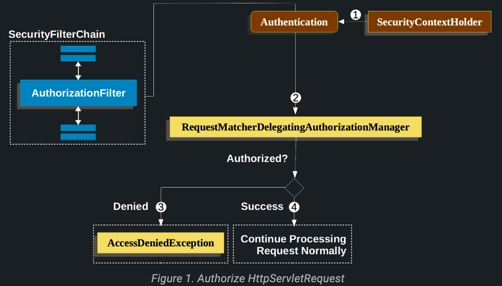

# Authorize HTTP Request

# [Authorize HttpServletRequests with AuthorizationFilter](https://docs.spring.io/spring-security/reference/servlet/authorization/authorize-http-requests.html)

> `AuthorizationFilter`는 `FilterSecurityInterceptor`를 대체한다.
>
- `AuthorizationFilter`는 `HttpServletRequests`에 대한 authorization을 제공한다.
    - 이 필터는 Security Filter의 하나로 `FilterChainProxy`에 삽입된다.
- `SecurityFilterChain`을 구성할 때 다음과 같이 설정할 수 있고 여러 개선점이 존재한다.

    ```java
    @Bean
    SecurityFilterChain web(HttpSecurity http) throws AuthenticationException {
        http
            .authorizeHttpRequests((authorize) -> authorize
                .anyRequest().authenticated();
            )
            // ...
    
        return http.build();
    }
    ```

    - `AuthorizationManager` API를 간소화해서 사용할 수 있다.
    - 재사용 및 커스텀도 간소화되었다.
    - `Authentication` 조회를 지연시킴으로써 인가가 필요한 요청에만 `Authentication`을 조회한다.
    - Bean-based 구성을 지원한다.

### 인가 흐름

1. `AuthorizationFilter`는 `SecurityContextHolder`로부터 인증을 가져온다.
    1. 조회를 지연시키기 위해 `Supplier`로 래핑한다.
2. `AuthorizationManager`에게 `Suppler<Authentication>`과 `HttpServletRequest`를 전달한다.
3. 인가가 거절되면 `AccessDeniedException`이 발생된다.
    1. `ExceptionTranslationFilter`가 해당 예외를 처리한다.
4. 인가가 성공하면 애플리케이션이 정상 처리될 수 있도록 `FilterChain`을 계속 진행한다.

### Authorization Requests 설정

```java
@Bean
SecurityFilterChain web(HttpSecurity http) throws Exception {
	http
		// ...
		.authorizeHttpRequests(authorize -> authorize
			.requestMatchers("/resources/**", "/signup", "/about").permitAll()
			.requestMatchers("/admin/**").hasRole("ADMIN")
			.requestMatchers("/db/**").access(new WebExpressionAuthorizationManager("hasRole('ADMIN') and hasRole('DBA')"))
			// .requestMatchers("/db/**").access(AuthorizationManagers.allOf(AuthorityAuthorizationManager.hasRole("ADMIN"), AuthorityAuthorizationManager.hasRole("DBA")))
			.anyRequest().denyAll()
		);

	return http.build();
}
```

- 각 규칙은 선언된 순서대로 고려된다.
- 위처럼 설정할 수도 있지만 커스텀 `AuthorizationManager`를 작성할 수도 있다.

    ```java
    @Bean
    SecurityFilterChain web(HttpSecurity http) throws Exception {
        http
            .authorizeHttpRequests((authorize) -> authorize
                .requestMatchers("/my/authorized/endpoint").access(new CustomAuthorizationManager());
            )
            // ...
    
        return http.build();
    }
    ```

    - 위 설정은 `/my/authorized/endpoint` URL에 대해서 커스텀 `AuthorizationManager`를 등록했다.
    - 전체 요청에 대해서도 커스텀 `AuthorizationManager`를 등록 가능하다.

    ```java
    @Bean
    SecurityFilterChain web(HttpSecurity http) throws Exception {
        http
            .authorizeHttpRequests((authorize) -> authorize
                .anyRequest().access(new CustomAuthorizationManager());
            )
            // ...
    
        return http.build();
    }
    ```

- 기본적으로 `AuthorizationFilter`는 모든 디스패처 유형에 적용되지만 `shouldFilterAllDispatcherTypes`를 이용해 모든 디스패처 유형에 적용하지 않도록 구성할 수도 있다.

    ```java
    @Bean
    SecurityFilterChain web(HttpSecurity http) throws Exception {
        http
            .authorizeHttpRequests((authorize) -> authorize
                .shouldFilterAllDispatcherTypes(false)
                .anyRequest().authenticated()
            )
            // ...
    
        return http.build();
    }
    ```

    - 특정 유형은 허용하는 방식을 선택할 수도 있다.

    ```java
    @Bean
    SecurityFilterChain web(HttpSecurity http) throws Exception {
        http
            .authorizeHttpRequests((authorize) -> authorize
                .dispatcherTypeMatchers(DispatcherType.ASYNC, DispatcherType.FORWARD).permitAll()
                .anyRequest().authenticated()
            )
            // ...
    
        return http.build();
    }
    ```

    - 특정 디스패처 타입에 특정한 역할이 요구되면 아래와 같이 구성할 수 있다.

    ```java
    @Bean
    SecurityFilterChain web(HttpSecurity http) throws Exception {
        http
            .authorizeHttpRequests((authorize) -> authorize
                .dispatcherTypeMatchers(DispatcherType.ERROR).hasRole("ADMIN")
                .anyRequest().authenticated()
            )
            // ...
    
        return http.build();
    }
    ```


## [Request Matchers](https://docs.spring.io/spring-security/reference/servlet/authorization/authorize-http-requests.html#_request_matchers)

- `RequestMatcher` 인터페이스는 주어진 규칙에 요청이 일치하는지 결정하는 데 사용된다.
- `securityMatcher`를 사용해서 요청에 HttpSecurity를 적용해야 하는지 여부를 결정한다.
- 같은 방식으로 `requestMatchers`를 사용해서 권한 부여 규칙을 정할 수 있다.

```java
@Configuration
@EnableWebSecurity
public class SecurityConfig {

	@Bean
	public SecurityFilterChain securityFilterChain(HttpSecurity http) throws Exception {
		http
			.securityMatcher("/api/**")
			.authorizeHttpRequests(authorize -> authorize
				.requestMatchers("/user/**").hasRole("USER")
				.requestMatchers("/admin/**").hasRole("ADMIN")
				.anyRequest().authenticated()
			)
			.formLogin(withDefaults());
		return http.build();
	}
}
```

- `securityMatcher(s)`와 `requestMatcher(s)` 메서드는 애플리케이션에 가장 적합한 구현체를 사용한다.
    - 스프링 MVC에는 `MvcRequestMatcher`가 사용되며 그렇지 않은 경우엔 `AntPathRequestMatcher`가 사용된다.
- 특정 `RequestMatcher`를 사용하고 싶다면 `securityMatcher`나 `requestMatcher`에 전달하면 된다.

```java
import static org.springframework.security.web.util.matcher.AntPathRequestMatcher.antMatcher;
import static org.springframework.security.web.util.matcher.RegexRequestMatcher.regexMatcher;

@Configuration
@EnableWebSecurity
public class SecurityConfig {

	@Bean
	public SecurityFilterChain securityFilterChain(HttpSecurity http) throws Exception {
		http
			.securityMatcher(antMatcher("/api/**"))                              
			.authorizeHttpRequests(authorize -> authorize
				.requestMatchers(antMatcher("/user/**")).hasRole("USER")         
				.requestMatchers(regexMatcher("/admin/.*")).hasRole("ADMIN")     
				.requestMatchers(new MyCustomRequestMatcher()).hasRole("SUPERVISOR")    
				.anyRequest().authenticated()
			)
			.formLogin(withDefaults());
		return http.build();
	}
}

public class MyCustomRequestMatcher implements RequestMatcher {

    @Override
    public boolean matches(HttpServletRequest request) {
        // ...
    }
}
```

