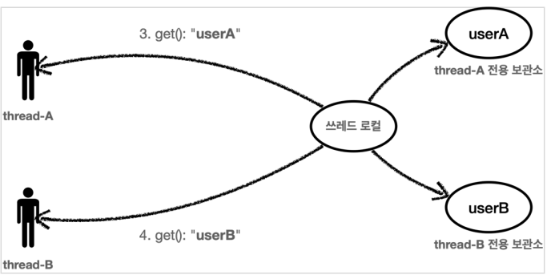
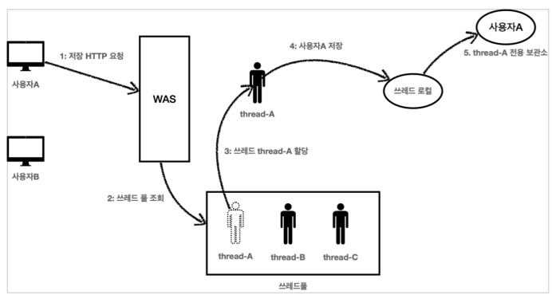
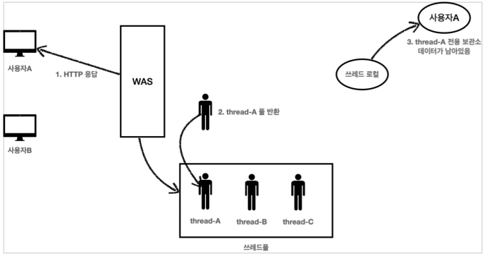

# ThreadLocal
### 동시성 문제

여러 쓰레드가 동시에 같은 인스턴스의 필드 값을 변경하면서 발생하는 문제를 동시성 문제라 한다. 이런 동시성 문제는 여러 쓰레드가 같은 인스턴스의 필드에 접근해야 하기 때문에 트래픽이 적은 상황에서는 확률상 잘 나타나지 않고, 트래픽이 점점 많아질 수 록 자주 발생한다.

특히 스프링 빈처럼 싱글톤 객체의 필드를 변경하며 사용할 때 이러한 동시성 문제를 조심해야 한다.

### 참고

> 이런 동시성 문제는 지역 변수에서는 발생하지 않는다. 지역 변수는 쓰레드마다 각각 다른 메모리 영역이 할당된다. 동시성 문제가 발생하는 곳은 같은 인스턴스의 필드(주로 싱글톤에서 자주 발생), 또는 static 같은 공용 필드에 접근할 때 발생한다. 동시성 문제는 값을 읽기만 하면 발생하지 않는다. 어디선가 값을 변경하기 때문에 발생한다.

## ThreadLocal 소개


- 쓰레드 로컬은 해당 쓰레드만 접근할 수 있는 특별한 저장소를 말한다
- 자바는 언어 차원에서 쓰레드 로컬을 지원하기 위한 `java.lang.ThreadLocal` 클래스를 제공한다

```java
private final ThreadLocal<String> nameStore = new ThreadLocal<>();
```

- `ThreadLocal` 사용법
    - 값 저장: `ThreadLocal.set(xxx)`
    - 값 조회: `ThreadLocal.get()`
    - 값 제거: `ThreadLocal.remove()`

> **주의**
해당 쓰레드가 쓰레드 로컬을 모두 사용하고 나면 `ThreadLocal.remove()` 를 호출해서 쓰레드 로컬에 저장된 값을 제거해주어야 한다.
>

## Thread Local 주의사항

쓰레드 로컬의 값을 사용 후 제거하지 않고 그냥 두면 WAS(톰캣)처럼 쓰레드 풀을 사용하는 경우에 심각한 문제가 발생할 수 있다.

**사용자 A 저장 요청**

1. 사용자A가 저장 HTTP를 요청했다.
2. WAS는 쓰레드 풀에서 쓰레드를 하나 조회한다.
3. 쓰레드 thread-A 가 할당되었다.
4. thread-A 는 사용자A 의 데이터를 쓰레드 로컬에 저장한다.
5. 쓰레드 로컬의 thread-A 전용 보관소에 사용자A 데이터를 보관한다.

**사용자 B 저장 요청 종료**


1. 사용자A의 HTTP 응답이 끝난다.
2. WAS는 사용이 끝난 thread-A 를 쓰레드 풀에 반환한다. 쓰레드를 생성하는 비용은 비싸기 때문에 쓰레드를 제거하지 않고, 보통 쓰레드 풀을 통해서 쓰레드를 재사용한다.
3. thread-A 는 쓰레드풀에 아직 살아있다. 따라서 쓰레드 로컬의 thread-A 전용 보관소에 사용자A
   데이터도 함께 살아있게 된다.

**문제점**

- 결과적으로 다른 사용자의 새로운 요청이 들어왔을 때 thread-A를 재사용하게 된다.
  - (사용자A의 데이터를 확인하게 되는 심각한 문제가 발생하게 된다.)
- 이런 문제를 예방하려면 사용자A의 요청이 끝날 때 쓰레드 로컬의 값을 `ThreadLocal.remove()`를 통해서 꼭 제거해야 한다.
  - 인터셉터나 필터에서 제거하도록 하자

### Q&A request scope vs ThreadLocal

- request 스코프는 HTTP 요청 + 스프링 안에서만 동작한다.
- 쓰레드 로컬은 HTTP 요청과 무관하게 동작하고 스프링과 상관없는 자바가 제공하는 기본 기능
- 따라서 더 범용으로 사용된다고 생각하면 됨
