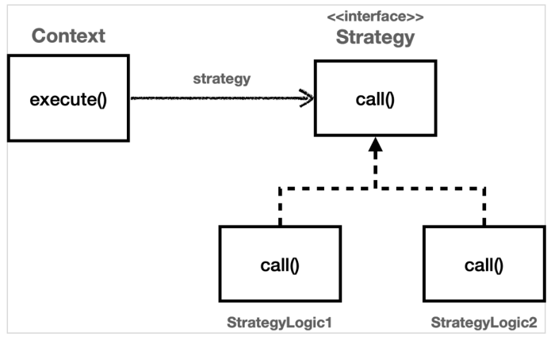
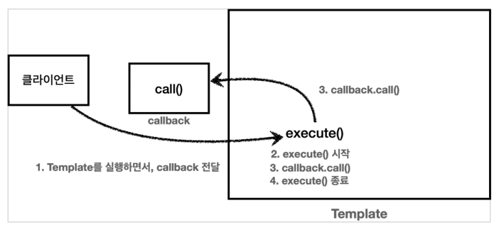

# 탬플릿 메서드 패턴과 콜백 패턴
### 핵심 기능 vs 부가 기능

- **핵심 기능**은 해당 객체가 제공하는 고유의 기능이다. 예를 들어서 `orderService`의 핵심 기능은 주문 로직이다. 메서드 단위로 보면 `orderService.orderItem(`)의 핵심 기능은 주문 데이터를 저장하기 위해 리포지토리를 호출하는 `orderRepository.save(itemId)` 코드가 핵심 기능이다.
- **부가 기능**은 핵심 기능을 보조하기 위해 제공되는 기능이다. 예를 들어서 로그 추적 로직, 트랜잭션 기능이 있다. 이러한 부가 기능은 단독으로 사용되지는 않고, 핵심 기능과 함께 사용된다. 예를 들어서 로그 추적 기능은 어떤 핵심 기능이 호출되었는지 로그를 남기기 위해 사용한다.
- 부가 기능을 붙이면 코드가 복잡해지고 핵심 기능에 집중할 수가 없다.
- 그런데 부가 기능에는 일정한 패턴이 있다.

### 변하는 것과 변하지 않는 것을 분리

- 좋은 설계는 변하는 것과 변하지 않는 것을 분리하는 것이다.여기서 핵심 기능 부분은 변하고, 로그 추적기를 사용하는 부분은 변하지 않는 부분이다.
- 이 둘을 분리해서 모듈화해야 한다.
- **템플릿 메서드 패턴(Template Method Pattern)**은 이런 문제를 해결하는 디자인 패턴이다.

## 템플릿 메서드 패턴 - 정의

GOF 디자인 패턴에서는 템플릿 메서드 패턴을 다음과 같이 정의했다.

> 템플릿 메서드 디자인 패턴의 목적은 다음과 같습니다.
"작업에서 알고리즘의 골격을 정의하고 일부 단계를 하위 클래스로 연기합니다. 템플릿 메서드를 사용하면 하위 클래스가 알고리즘의 구조를 변경하지 않고도 알고리즘의 특정 단계를 재정의할 수 있습니다." [GOF]

- 부모 클래스에 알고리즘의 골격인 템플릿을 정의
- 일부 변경되는 로직은 자식 클래스에 정의
- 이렇게 하면 자식 클래스가 알고리즘의 전체 구조를 변경하지 않고, 특정 부분만 재정의할 수 있다.
- 결국 상속과 오버라이딩을 통한 다형성으로 문제를 해결하는 것이다.

**하지만**

- 템플릿 메서드 패턴은 상속을 사용한다. 따라서 상속에서 오는 단점들을 그대로 안고 간다.
- 특히 자식 클래스가 부모 클래스와 컴파일 시점에 강하게 결합되는 문제가 있다.
- 이것은 의존 관계에 대한 문제이다. 자식 클래스 입장에서는 부모 클래스의 기능을 전혀 사용하지 않는다.

### 상속의 단점

- 자식 클래스의 `extends`다음에 바로 부모 클래스가 코드 상에 지정되어 있다. 따라서 부모 클래스의 기능을 사용하든 사용하지 않든 간에 부모 클래스를 강하게 의존하게 된다.
- 여기서 강하게 의존한다는 뜻은 자식 클래스의 코드에 부모 클래스의 코드가 명확하게 적혀 있다는 뜻이다. UML에서 상속을 받으면 삼각형 화살표가 자식 -> 부모 를 향하고 있는 것은 이런 의존 관계를 반영하는 것이다.
- 자식 클래스 입장에서는 부모 클래스의 기능을 전혀 사용하지 않는데, 부모 클래스를 알아야한다. 이것은 좋은 설계가 아니다.
- 부모 클래스를 수정하면, 자식 클래스에도 영향을 줄 수 있다.
- 추가로 템플릿 메서드 패턴은 상속 구조를 사용하기 때문에, 별도의 클래스나 익명 내부 클래스를 만들어야 하는 부분도 복잡하다.

템플릿 메서드 패턴과 비슷한 역할을 하면서 상속의 단점을 제거할 수 있는 디자인 패턴이 바로 **전략 패턴 (Strategy Pattern)**이다

## 전략 패턴

전략 패턴은 변하지 않는 부분을 Context라는 곳에 두고, 변하는 부분을 Strategy라는 인터페이스를
만들고 해당 인터페이스를 구현하도록 해서 문제를 해결한다. 상속이 아니라 위임으로 문제를 해결하는 것이다.

전략 패턴에서 Context 는 변하지 않는 템플릿 역할을 하고, Strategy 는 변하는 알고리즘 역할을 한다.

GOF 디자인 패턴에서 정의한 전략 패턴의 **의도**는 다음과 같다.

> 알고리즘 제품군을 정의하고 각각을 캡슐화하여 상호 교환 가능하게 만들자. 전략을 사용하면 알고리즘을 사용하는 클라이언트와 독립적으로 알고리즘을 변경할 수 있다.


쉽게 이야기해서 컨텍스트(문맥)는 크게 변하지 않지만, 그 문맥 속에서 strategy를 통해 일부 전략이
변경된다 생각하면 된다.

```java
public class ContextV1 {

		private final Strategy strategy;

		public ContextV1(Strategy strategy) {
		    this.strategy = strategy;
		}

		public void execute() {
			long startTime = System.currentTimeMillis();

			// 비즈니스 로직 실행
			strategy.call();
			// 비즈니스 로직 죵로

			long endTime = System.currentTimeMillis();
			long resultTime = endTime - startTime;
			log.info("resultTime={}", resultTime);
		}
}
```

### 선 조립, 후 실행

- 여기서 이야기하고 싶은 부분은 `ContextV1`의 내부 필드에 Strategy를 두고 사용하는 부분이다.
- 이 방식은 `ContextV1`와 Strategy를 실행 전에 원하는 모양으로 조립해두고, 그 다음에 `ContextV1`를 실행하는 선 조립, 후 실행 방식에서 매우 유용하다.
- 스프링으로 애플리케이션을 개발할 때 애플리케이션 로딩 시점에 의존 관계 주입을 통해 필요한 의존 관계를 모두 맺어두고 난 다음에 실제 요청을 처리하는 것 과 같은 원리이다.
- 이 방식의 단점은 조립한 이후에는 전략을 변경하기가 번거롭다는 점이다.
- 그래서 전략을 실시간으로 변경해야 하면 차라리 Context를 하나 더 생성하고 그곳에 다른 Strategy를 주입하는 것이 더 나은 선택일 수 있다.
- 아니면 전략을 사용하는 메서드를 실행할 때 전략을 파라미터로 받아서 실행할 수도 있다. (ContextV2)

```java
public class ContextV2 {

	public void execute(Strategy strategy) {
		long startTime = System.currentTimeMillis();

		// 비즈니스 로직 실행
		strategy.call();
		// 비즈니스 로직 죵로

		long endTime = System.currentTimeMillis();
		long resultTime = endTime - startTime;
		log.info("resultTime={}", resultTime);
	}
}
```

## 탬플릿 콜백 패턴

다른 코드의 인수로서 넘겨주는 실행 가능한 코드를 **콜백(callback)**이라 한다.

> **콜백 정의**
프로그래밍에서 콜백(callback) 또는 콜애프터 함수(call-after function)는 다른 코드의 인수로서
넘겨주는 실행 가능한 코드를 말한다. 콜백을 넘겨받는 코드는 이 콜백을 필요에 따라 즉시 실행할 수도 있고, 아니면 나중에 실행할 수도 있다. (위키백과 참고)
>

쉽게 이야기해서 callback 은 코드가 호출( call )은 되는데 코드를 넘겨준 곳의 뒤( back )에서
실행된다는 뜻이다.

- `ContextV2` 예제에서 콜백은 Strategy이다.
- 여기에서는 클라이언트에서 직접 Strategy를 실행하는 것이 아니다.
- 클라이언트가 `ContextV2.execute(..)` 를 실행할 때 Strategy를 넘겨주고, `ContextV2` 뒤에서 Strategy 가 실행된다.

### 스프링에서의 템플릿 콜백 패턴

- 스프링에서는 `ContextV2`와 같은 방식의 전략 패턴을 템플릿 콜백 패턴이라 한다.
- 전략 패턴에서 Context가 템플릿 , Strategy 부분이 콜백
- 참고로 템플릿 콜백 패턴은 GOF 패턴은 아니고, 스프링 내부에서 이런 방식을 자주 사용하기 때문에, 스프링 안에서만 이렇게 부른다. 전략 패턴에서 템플릿과 콜백 부분이 강조된 패턴이라 생각하면 된다.
- 스프링에서는 `JdbcTemplate`, `RestTemplate` , `TransactionTemplate` , `RedisTemplate` 처럼 다양한 템플릿 콜백 패턴이 사용된다. 스프링에서 이름에 `XxxTemplate`가 있다면 템플릿 콜백 패턴으로 만들어져 있다 생각하면 된다.

