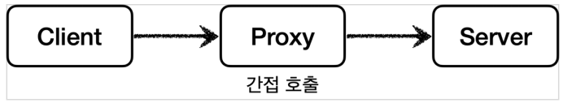
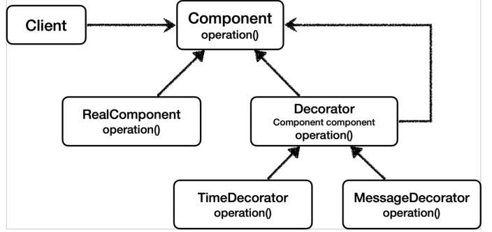
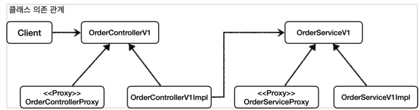
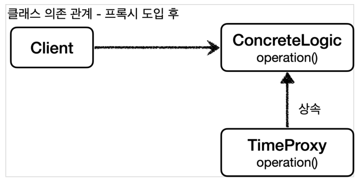

# 프록시 패턴과 데코레이터 패턴
## 클라이언트와 서버
- 클라이언트( Client )와 서버( Server )라고 하면 개발자들은 보통 서버 컴퓨터를 생각한다.
- 사실 클라이언트는 의뢰인이라는 뜻이고, 서버는 ‘서비스나 상품을 제공하는’이라는 뜻을 가진다.
- 이 개념을 객체에 도입하면, 요청하는 객체는 클라이언트가 되고, 요청을 처리하는 객체는 서버가 된다.

### 직접 호출

- 클라이언트와 서버 관계에서 일반적으로 클라이언트가 직접 서버를 호출하고 결과를 직접 받는다. 이를 직접 호출이라 한다.

### 간접 호출

### 대체 가능

- 아무 객체나 프록시가 될 수 있는 것은 아니다.
- 프록시가 되기 위해선 클라이언트는 서버에게 요청을 한 것인지, 프록시에게 요청을 한 것인지 몰라야 한다.
- 즉 서버와 프록시는 같은 인터페이스를 사용해야 한다.
- 클라이언트가 사용하는 서버 객체를 프록시 객체로 변경해도 클라이언트 코드를 변경하지 않고 동작할 수 있어야 한다.
    - DI를 통해 대체 가능
### 프록시의 주요 기능

- **접근 제어**
    - 권한에 따른 접근 차단
    - 캐싱
    - 지연 로딩
- **부가 기능 추가**
    - 원래 서버가 제공하는 기능에 대해 부가 기능을 수행
    - 예) 요청, 응답 값을 중간에 변형
    - 예) 실행 시간 측정, 추가 로그 남김

### GOF 디자인 패턴

- 프록시 패턴과 데코레이터 패턴 둘 다 프록시를 사용하여 구현하지만 의도가 다르다.
- 프록시와 프록시 패턴은 엄밀히 말해 다르다.
- **프록시 패턴** - 접근 제어가 목적
- **데코레이터 패턴** - 새로운 기능 추가가 목적

> **참고**: 프록시라는 개념은 클라이언트 서버라는 큰 개념 안에서 자연스럽게 발생할 수 있다. 객체에서의 프록시도 있고, 웹 서버에서의 프록시도 있다.
>

### GOF의 데코레이터 패턴

- `Decorator`를 추상 클래스로 뺀 이유는 중복을 줄이기 위해서다.
    - 추상 클래스가 없다면 `TimeDecorator`, `MessageDecorator` 모두 꾸며줄 대상인 target `Component`를 스스로가 가지고 있으면서 호출도 스스로 해야 한다.
    - 이 부분이 모든 Decorator들이 중복 하여 가지고 있어야 하는 것이고 이를 추상 클래스로 빼서 target을 가지는 책임과 부가 기능을 수행하는 책임을 나눌 수 있다.

## 인터페이스 기반 프록시와 클래스 기반 프록시

### 인터페이스로 프록시 만들기

- interface 기반으로 서버 로직을 구현해야 한다.
- Client가 interface를 의존하게 한다.
- 프록시가 interface를 구현하고 내부에 target(실제 구체 클래스)을 가지고 부가 기능 등을 추가한다.
### 구체 클래스에서 프록시 만들기

- interface가 없는 구체 클래스를 상속하여 프록시를 만든다.
- 런타임에 Client 클래스에 상속 클래스를 주입한다.
- **상속 기반 프록시의 단점**
    - 자바 기본 문법에 의해 자식 클래스를 생성할 때 부모 클래스의 생성자를 호출해야 한다. 부모 클래스에 파라미터가 있는 생성자만 있는 경우 `super()`를 통해 호출해야 한다.
    - 프록시 클래스에선 target 클래스를 의존 주입 받기 때문에 부모의 의존 관계까지 필요 없는 경우가 있다. `super(null)` 코드를 호출할 수밖에 없다.
    - 클래스에 final 키워드가 붙으면 상속이 불가능하다.
    - 메서드에 final 키워드가 붙으면 해당 메서드를 오버라이딩 할 수 없다.

### 정리

- 클래스 기반 프록시의 단점 때문에 인터페이스 기반의 프록시가 더 좋아 보인다.
- 인터페이스 기반 프록시는 상속에서 오는 제약에서 자유롭다.
- 하지만 인터페이스 기반 프록시의 단점은 인터페이스가 필요하다는 그 자체이다.
- 인터페이스를 도입하는 다양한 이유가 있는데 **인터페이스가 항상 필요하지는 않다.**
- **너무 많은 프록시 클래스**
    - 프록시를 통해 기존 코드 변경 없이 부가 기능을 추가할 수 있었다.
    - 문제는 프록시 클래스를 너무 많이 만들어야 하는 것이다.
    - 만약 대상 클래스가 100개라면 프록시 클래스도 100개를 만들어야 한다.
