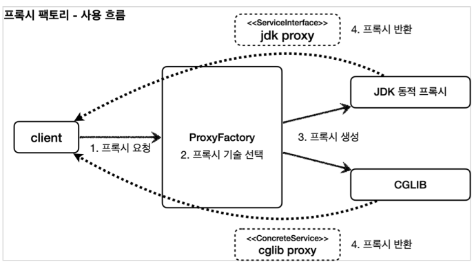
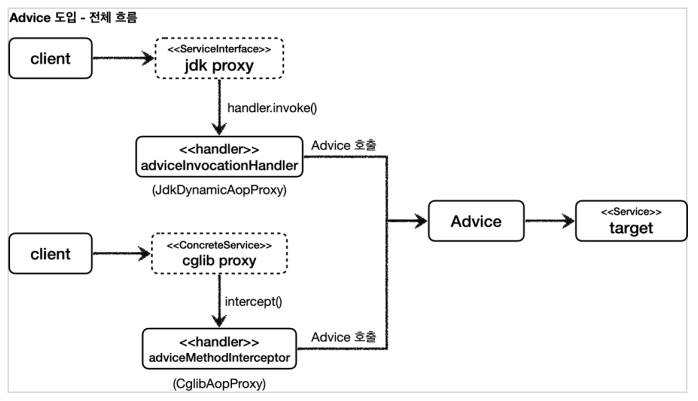
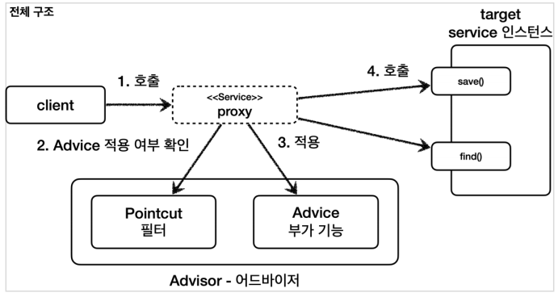
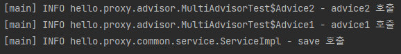

# 스프링이 지원하는 프록시
## 프록시 팩토리 - 소개

**Q. 인터페이스가 있는 경우에는 JDK 동적 프록시를 적용하고, 그렇지 않은 경우에는 CGLIB를
적용하려면 어떻게 해야할까?**

- 스프링은 동적 프록시를 통합해서 편리하게 만들어주는 프록시 팩토리(`ProxyFactory`)라는 기능을 제공한다
- 프록시 팩토리는 인터페이스가 있으면 JDK 동적 프록시를 사용하고, 구체 클래스만 있다면 CGLIB를 사용한다.
- 이 설정을 변경할 수도 있다.

  **Q. 두 기술을 함께 사용할 때 부가 기능을 적용하기 위해 JDK 동적 프록시가 제공하는
  InvocationHandler와 CGLIB가 제공하는 MethodInterceptor를 각각 중복으로 따로 만들어야
  할까?**

- 부가 기능을 적용할 때 `Advice`라는 새로운 개념을 도입
- 개발자는 `InvocationHandler`나 `MethodInterceptor`를 신경 쓰지 않고 `Advice`만 만들면 된다.
- 결과적으로 `InvocationHandler`나 `MethodInterceptor`는 `Advice`를 호출하게 된다.
- 프록시 팩토리를 사용하면 Advice를 호출하는 전용 `InvocationHandler`나 `MethodInterceptor`를 내부에서 사용한다.

  **Q. 특정 조건에 맞을 때 프록시 로직을 적용하는 기능도 공통으로 제공되었으면?**

- 스프링은 `Pointcut`이라는 개념으로 이 문제를 일관성 있게 해결한다.

## 프록시 팩토리 - 코드

`Advice`는 프록시에 적용하는 부가 기능 로직이다. 이것은 JDK 동적 프록시가 제공하는
`InvocationHandler`와 CGLIB가 제공하는 `MethodInterceptor`의 개념과 유사하다. 둘을 개념적으로 추상화 한 것이다. 프록시 팩토리를 사용하면 둘 대신에 `Advice`를 사용하면 된다

### MethodInterceptor로 Advice 만들기

```java
package org.aopalliance.intercept;

@FunctionalInterface
public interface MethodInterceptor extends Interceptor {

	@Nullable
	Object invoke(@Nonnull MethodInvocation invocation) throws Throwable;
}
```

- CGLIB의 `MethodInterceptor`와 이름이 같으므로 패키지 이름에 주의하자
- `MethodInterceptor`는 `Interceptor`를 상속하고 `Interceptor`는 `Advice` 인터페이스를 상속
- `MethodInvocation invocation`
    - 내부에는 다음 메서드를 호출하는 방법, 현재 프록시 객체 인스턴스, args , 메서드 정보 등이
      포함되어 있다. 기존에 파라미터로 제공되는 부분들이 이 안으로 모두 들어갔다고 생각하면 된다.

```java
public class LogTraceAdvice implements MethodInterceptor {

    private final LogTrace logTrace;

    public LogTraceAdvice(LogTrace logTrace) {
        this.logTrace = logTrace;
    }

    @Override
    public Object invoke(MethodInvocation invocation) throws Throwable {
        TraceStatus status = null;
        try {
            Method method = invocation.getMethod();
            String message = method.getDeclaringClass().getSimpleName() + "." +
                    method.getName() + "()";
            status = logTrace.begin(message);

            //로직 호출
            Object result = invocation.proceed();

            logTrace.end(status);
            return result;
        } catch (Exception e) {
            logTrace.exception(status, e);
            throw e;
        }
    }
}
```

- `Object result = invocation.proceed()`
    - target 클래스를 호출하고 그 결과를 받는다.
    - `MethodInvocation` 안에 target 정보도 들어 있다.
    - 프록시 팩토리로 프록시를 생성하는 단계에서 이미 target 정보를 파라미터로 전달 받는다.

```java
// 인터페이스는 JDK 동적 프록시 사용
ServiceInterface target = new ServiceImpl();
ProxyFactory proxyFactory = new ProxyFactory(target);
proxyFactory.addAdvice(new TimeAdvice());
ServiceInterface proxy = (ServiceInterface) proxyFactory.getProxy();

proxy.save();

// 구체 클래스는 CGLIB 프록시 사용
ConcreteService target = new ConcreteService();
ProxyFactory proxyFactory = new ProxyFactory(target);
proxyFactory.addAdvice(new TimeAdvice());
ConcreteService proxy = (ConcreteService) proxyFactory.getProxy();
        
proxy.call();
```

- `new ProxyFactory(target)`
    - 프록시 팩토리는 이 인스턴스 정보를 기반으로 프록시를 만들어낸다. 만약 이 인스턴스에
      인터페이스가 있다면 JDK 동적 프록시를 기본으로 사용하고 인터페이스가 없고 구체 클래스만 있다면 CGLIB를 통해서 동적 프록시를 생성한다.
- `proxyFactory.addAdvice(new TimeAdvice())`
    - 프록시가 사용할 부가 기능 로직을 설정
- `proxyFactory.getProxy()`: 프록시 객체를 생성하고 그 결과를 받는다.

```java
assertThat(AopUtils.isAopProxy(proxy)).isTrue();
assertThat(AopUtils.isJdkDynamicProxy(proxy)).isTrue();
assertThat(AopUtils.isCglibProxy(proxy)).isFalse();
```

- `ProxyFactory`로 프록시를 만들었다면 `AopUtils`로 어떤 프록시인지 간단하게 확인할 수 있다.

```java
proxyFactory.setProxyTargetClass(true);
```

- 이 옵션에 true 값을 넣으면 인터페이스가 있어도 강제로 CGLIB를 사용한다. 그리고 인터페이스가 아닌 클래스 기반의 프록시를 만들어준다.

> 스프링 부트는 AOP를 적용할 때 기본적으로 `proxyTargetClass=true`로 설정해서 사용한다.
따라서 인터페이스가 있어도 항상 CGLIB를 사용해서 프록시를 생성한다.
>

> 프록시 팩토리의 서비스 추상화 덕분에 구체적인 CGLIB, JDK 동적 프록시 기술에 의존하지 않고, 매우 편리하게 동적 프록시를 생성할 수 있다.
>

## 포인트컷, 어드바이스, 어드바이저

- **포인트컷(Pointcut)**: 어디에 부가 기능을 적용할지 판단하는 필터링 로직
- **어드바이스(Advice)**: 프록시가 호출하는 부가 기능
- **어드바이저(Advisor)**: 단순하게 하나의 포인트컷과 하나의 어드바이스를 가지고 있는 것
    - 포인트컷 + 어드바이스
- 이렇게 구분한 것은 **역할과 책임을 명확하게 분리**한 것이다.
    - 포인트컷은 대상 여부를 확인하는 필터 역할만 담당한다.
    - 어드바이스는 깔끔하게 부가 기능 로직만 담당한다.
    - 둘을 합치면 어드바이저가 된다. 스프링의 어드바이저는 하나의 포인트컷 + 하나의 어드바이스로 구성된다.


### 어드바이저

프록시 팩토리를 통해 프록시를 생성할 때 어드바이저를 제공하면 어디에 어떤 기능을 제공할 지 알 수 있다.
```java
ServiceInterface target = new ServiceImpl();
ProxyFactory proxyFactory = new ProxyFactory(target);
DefaultPointcutAdvisor advisor = new DefaultPointcutAdvisor(Pointcut.TRUE, new TimeAdvice());
proxyFactory.addAdvisor(advisor);
ServiceInterface proxy = (ServiceInterface) proxyFactory.getProxy();

proxy.save();
proxy.find();
```

- `new DefaultPointcutAdvisor`
  - `Advisor` 인터페이스의 가장 일반적인 구현체로 생성자를 통해 하나의 포인트컷과 하나의 어드바이스를 넣어 준다.
  - `TimeAdvice`는 `Advice`의 구현체
- `Pointcut.TRUE`: 항상 true를 반환하는 포인트컷
- `proxyFactory.addAdvisor(advisor)`: 프록시 팩토리에 적용할 어드바이저를 지정

### 포인트컷 (Pointcut 인터페이스)

```java
public interface Pointcut {
		ClassFilter getClassFilter();
		MethodMatcher getMethodMatcher();
}

public interface ClassFilter {
		boolean matches(Class<?> clazz);
}

public interface MethodMatcher {
		boolean matches(Method method, Class<?> targetClass);
		//..
}
```

- 포인트컷은 크게 `ClassFilter`와 `MethodMatcher` 둘로 이루어진다. 이름 그대로 하나는 클래스가 맞는지, 하나는 메서드가 맞는지 확인할 때 사용한다. 둘 다 true로 반환해야 어드바이스를 적용할 수 있다.

### 스프링이 제공하는 포인트컷

- `NameMatchMethodPointcut`: 메서드 이름 기반으로 매칭. 내부에서 `PatternMatchUtils`를 사용

    ```java
    ServiceInterface target = new ServiceImpl();
    ProxyFactory proxyFactory = new ProxyFactory(target);
    
    NameMatchMethodPointcut pointcut = new NameMatchMethodPointcut();
    pointcut.setMappedNames("save");
    
    DefaultPointcutAdvisor advisor = new DefaultPointcutAdvisor(pointcut, new TimeAdvice());
    proxyFactory.addAdvisor(advisor);
    
    ServiceInterface proxy = (ServiceInterface) proxyFactory.getProxy();
    proxy.save();
    proxy.find();
    ```

  - `PatternMatchUtils.*simpleMatch*`
  - 예) `*save*`
- `JdkRegexpMethodPointcut`: JDK 정규 표현식 기반으로 매칭
- `TruePointcut`: 항상 참을 반환
- `AnnotationMatchingPointcut`: 애노테이션으로 매칭
- `AspectJExpressionPointcut`: aspectJ 표현식으로 매칭
  - 실무에서는 사용하기도 편리하고 기능도 가장 많은 aspectJ 표현식을 기반으로 사용하는 `AspectJExpressionPointcut`을 사용하게 된다.

### 여러 어드바이저 적용

- 만약 적용해야 하는어드바이저가 10개라면 10개의 프록시를 생성해야한다.
- 스프링은 이 문제를 해결하기 위해 하나의 프록시에 여러 어드바이저를 적용할 수 있게 만들어두었다.
```java
//client -> proxy -> advisor2 -> advisor1 -> target

DefaultPointcutAdvisor advisor1 = new DefaultPointcutAdvisor(Pointcut.TRUE, new Advice1());
DefaultPointcutAdvisor advisor2 = new DefaultPointcutAdvisor(Pointcut.TRUE, new Advice2());

// 프록시1 생성
ServiceInterface target = new ServiceImpl();
ProxyFactory proxyFactory1 = new ProxyFactory(target);

proxyFactory1.addAdvisor(advisor2);
proxyFactory1.addAdvisor(advisor1);
ServiceInterface proxy = (ServiceInterface) proxyFactory1.getProxy();

//실행
proxy.save();
```

- 프록시 팩토리에 원하는 만큼 `addAdvisor()`를 통해서 어드바이저를 등록하면 된다.
- 등록하는 순서대로 advisor가 호출된다. 여기서는 advisor2 , advisor1 순서로 등록했다.

> 스프링은 AOP를 적용할 때, 최적화를 진행해서 지금처럼 프록시는 하나만 만들고, 하나의 프록시에 여러 어드바이저를 적용한다.
**정리하면 하나의 target 에 여러 AOP가 동시에 적용되어도, 스프링의 AOP는 target 마다 하나의 프록시만 생성한다.**
>

## 남은 문제

- **너무 많은 설정**
  - config 파일이 지나치게 많아 진다. 이는 빈을 등록할 때 일일이 `ProxyFactory`를 통해 프록시를 빈으로 띄워야 하기 때문이다.
- **컴포넌트 스캔**
  - 위와 같은 이유로 컴포넌트 스캔 방법으로 빈을 등록하면 프록시로 대체할 수 없다.
