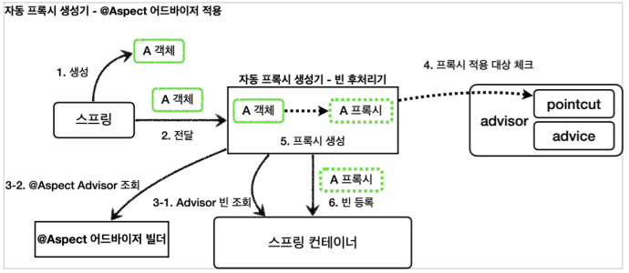

# @Aspect AOP
## @Aspect 프록시 - 코드

- 스프링에서 프록시를 적용하려면 포인트컷과 어드바이스로 구성되어 있는 어드바이저를 만들어서 스프링 빈으로 등록하면 된다.
- 어드바이저를 빈 등록만 하면 나무지는 자동 프록시 생성기가 처리해준다.
- 자동 프록시 생성기는 등록된 어드바이저를 찾고, 스프링 빈들에 자동으로 프록시를 적용한다.
- `@Aspect` 애노테이션으로 매우 편리하게 포인트컷과 어드바이스로 구성되어 있는 어드바이저 생성 기능을 지원한다.

> 참고: `@Aspect`는 관점 지향 프로그래밍(AOP)을 가능하게 하는 AspectJ 프로젝트에서 제공하는
애노테이션이다. 스프링은 이것을 차용해서 프록시를 통한 AOP를 가능하게 한다.
>

```java
@Aspect
@Component
public class LogTraceAspect {

    private final LogTrace logTrace;

    public LogTraceAspect(LogTrace logTrace) {
        this.logTrace = logTrace;
    }

    @Around("execution(* hello.proxy.app..*(..))")
    public Object execute(ProceedingJoinPoint joinPoint) throws Throwable {
        TraceStatus status = null;
        try {
            String message = joinPoint.getSignature().toShortString();
            status = logTrace.begin(message);

            //로직 호출
            Object result = joinPoint.proceed();

            logTrace.end(status);
            return result;
        } catch (Exception e) {
            logTrace.exception(status, e);
            throw e;
        }
    }
}
```

- `@Aspect`: 애노테이션 기반 프록시를 적용할 때 필요
- `@Around("execution(* hello.proxy.app..*(..))")`
    - `@Around` 값 안에 포인트컷 표현식을 넣는다. (AspectJ 표현식)
    - `@Around`의 메서드는 어드바이스(`Advice`)가 된다.
- `ProceedingJoinPoint joinPoint`: `MethodInvocation`과 유사한 기능이다. 내부에 실제 호출 대상, 전달 인자, 그리고 어떤 객체와 어떤 메서드가 호출되었는지 정보가 포함되어 있다.
- `joinPoint.proceed()`: target을 호출한다.

## @Aspect 프록시 - 설명

- 자동 프록시 생성기(`AnnotationAwareAspectJAutoProxyCreator`)는 2가지 일을 한다.
    - `Advisor`를 찾아서 필요한 빈에 프록시를 생성 및 적용
    - `@Aspect`를 찾아서 이것을 `Advisor`로 변환하여 저장

### @Aspect를 어드바이저로 변환, 저장하는 과정
1. **실행**: 스프링 로딩 시점에 자동 프록시 생성기 호출
2. **모든 @Aspect 빈 조회**
3. **어드바이저 생성**: `@Aspect` 어드바이저 빌더를 통해 `@Aspect` 정보를 기반으로 어드바이저 생성
4. **어드바이저 저장**: 생성한 어드바이저를 @Aspect 어드바이저 빌더 내부에 저장
- `BeanFactoryAspectJAdvisorBuilder`
    - `@Aspect` 정보를 기반으로 포인트컷, 어드바이스, 어드바이저를 생성하고 보관한다.

### 어드바이저 기반으로 프록시 생성

1. **생성**: 스프링 빈 대상이 되는 객체를 생성
2. **전달**: 빈들을 후 처리기(자동 프록시 생성기)에 전달
3. **`Advisor` 빈 조회**: 스프링 컨테이너에서 Advisor 빈을 모두 조회
4. `**@Aspect` `Advisor` 조회**: `@Aspect` 어드바이저 빌더 내부의 `Advisor`를 모두 조회
5. **프록시 적용 대상 체크**: 조회한 Advisor에 포함되어 있는 포인트컷으로 빈이 프록시 적용 대상인지 아닌지 판단한다.
6. **프록시 생성**: 프록시 적용 대상 빈의 프록시를 생성하고 반환한다. 적용 대상이 아니면 원본 객체를 반환한다.
7. **빈 등록**: 반환된 객체는 스프링 빈으로 등록된다.
