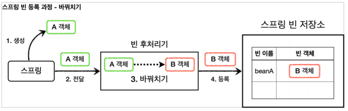
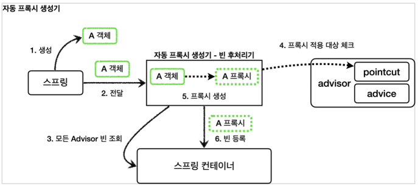

# 빈 후처리기
### 빈 후처리기를 사용하지 않고 동적 프록시를 등록하려면

- **너무 많은 설정**

    ```java
    @Bean
    public OrderControllerV1 orderControllerV1(LogTrace logTrace) {
        OrderControllerV1 orderController = new OrderControllerV1Impl(orderServiceV1(logTrace));
        ProxyFactory factory = new ProxyFactory(orderController);
        factory.addAdvisor(getAdvisor(logTrace));
        OrderControllerV1 proxy = (OrderControllerV1) factory.getProxy();
        log.info("ProxyFactory proxy={}, target={}", proxy.getClass(), orderController.getClass());
        return proxy;
    }
    ```

    - config 파일이 지나치게 많아 진다. 이는 빈을 등록할 때 일일이 위처 `ProxyFactory`를 통해 프록시를 빈으로 띄워야 하기 때문이다.
- **컴포넌트 스캔**
    - 위와 같은 이유로 컴포넌트 스캔 방법으로 빈을 등록하면 프록시로 대체할 수 없다.

## BeanPostProcessor

- 스프링이 빈 저장소에 등록할 목적으로 생성한 객체를 빈 저장소에 등록하기 직전에 조작하고 싶다면 빈 후처리기를 사용하면 된다.

### 빈 후처리기 과정

1. **생성**: 스프링 빈 대상이 되는 객체 생성 `(@Bean`, 컴포넌트 스캔 모두 포함)
2. **전달**: 생성된 객체를 빈 저장소에 등록하기 직전에 후 처리기에 전달
3. **후 처리 작업**: 전달된 스프링 객체를 조작하거나 다른 객체로 바꿔치기 할 수 있다
4. **등록**: 빈 후처리기는 빈을 반환한다. 반환된 빈은 빈 저장소에 등록 된다.

### BeanPostProcessor 인터페이스

```java
public interface BeanPostProcessor {
		Object postProcessBeforeInitialization(Object bean, String beanName) throws BeansException
		Object postProcessAfterInitialization(Object bean, String beanName) throws BeansException
}
```

- 빈 후처리기를 사용하려면 `BeanPostProcessor` 인터페이스를 구현하고, 스프링 빈으로 등록하면 된다.
- `postProcessBeforeInitialization`: 객체 생성 이후에 `@PostConstruct` 같은 초기화 발생하기 전에 호출되는 프로세서
- `postProcessAfterInitialization`: 객체 생성 이후에 `@PostConstruct` 같은 초기화가 발생한 다음에 호출되는 프로세서

```java
@Bean
public AToBPostProcessor helloPostProcessor() {
		return new AToBPostProcessor();
}

static class AToBPostProcessor implements BeanPostProcessor {

		@Override
		public Object postProcessAfterInitialization(Object bean, String beanName) throws BeansException {
			if (bean instanceof A) {
				 return new B();
			}
			return bean;
		}
}
```

> **@PostConstruct의 비밀**
스프링은 `CommonAnnotationBeanPostProcessor`라는 빈 후처리기를 자동으로 등록하는데, 여기에서 `@PostConstruct` 애노테이션이 붙은 메서드를 호출한다. 따라서 스프링 스스로도 스프링 내부의 기능을 확장하기 위해 빈 후처리기를 사용한다.
>

> 빈 후처리기로 프록시를 생성한다면 프록시를 생성하는 부분을 하나로 집중할 수 있다. 그리고 컴포넌트 스캔처럼 스프링이 직접 대상을 빈으로 등록하는 경우에도 중간에 빈 등록 과정을 가로채서 원본 대신에 프록시를 스프링빈으로 등록할 수 있다.
>

## 스프링이 제공하는 빈 후처리기

스프링은 프록시를 생성하기 위한 빈 후처리기를 이미 만들어서 제공한다.

`build.gradle` 추가

```java
implementation 'org.springframework.boot:spring-boot-starter-aop'
```

라이브러리를 추가하면 `aspectjweaver`라는 aspectJ 관련 라이브러리를 등록하고, 스프링 부트가
AOP 관련 클래스를 자동으로 스프링 빈에 등록한다.

### 자동 프록시 생성기 - AutoProxyCreator

- 스프링 부트 자동 설정으로 `AnnotationAwareAspectJAutoProxyCreator`라는 빈 후처리기가 스프링 빈에 자동으로 등록된다.
- 이름 그대로 자동으로 프록시를 생성해주는 빈 후처리기이다.
- 이 빈 후처리기는 스프링 빈으로 등록된 `Advisor`들을 자동으로 찾아서 프록시가 필요한 곳에 자동으로 프록시를 적용해준다.
- `Advisor` 안에는 `Pointcut`과 `Advice`가 이미 모두 포함되어 있다. 따라서 `Advisor`만 알고 있으면 그 안에 있는 `Pointcut`으로 어떤 스프링 빈에 프록시를 적용해야 할지 알 수 있다. 그리고 `Advice`로 부가 기능을 적용하면 된다.

> **참고**
`AnnotationAwareAspectJAutoProxyCreator`는 `@AspectJ`와 관련된 AOP 기능도 자동으로 찾아서 처리해준다.
Advisor는 물론이고, `@Aspect`도 자동으로 인식해서 프록시를 만들고 AOP를 적용해준다.


1. **생성**: 스프링이 스프링 빈 대상이 되는 객체를 생성한다. ( `@Bean` , 컴포넌트 스캔 모두 포함)
2. **전달**: 생성된 객체를 빈 저장소에 등록하기 직전에 빈 후처리기에 전달한다.
3. **모든 Advisor 빈 조회**: 자동 프록시 생성기는는 스프링 컨테이너에서 모든 `Advisor`를 조회한다.
4. **프록시 적용 대상 체크**: 앞서 조회한 `Advisor`에 포함되어 있는 포인트컷을 사용해서 해당 객체가 프록시를 적용할 대상인지 아닌지 판단한다. 이때 객체의 클래스 정보는 물론이고, 해당 객체의 모든 메서드를 포인트컷에 하나하나 모두 매칭해본다.
5. **프록시 생성**: 프록시 적용 대상이면 프록시를 생성하고 반환해서 빈으로 등록한다.
6. **빈 등록**: 반환된 객체는 스프링 빈으로 등록된다.
- 프록시는 내부에 어드바이저와 실제 호출한 대상 객체(target)을 알고 있다.

### 포인트컷은 2가지에 사용된다.

1. **프록시 적용 여부 판단 - 생성 단계**
  1. 해당 빈이 프록시를 생성할 필요가 있는지 없는지 체크한다.
  2. 클래스, 메서드 조건을 모두 비교하여 하나라도 있으면 프록시를 생성한다.
  3. 만약 조건에 맞는 것이 하나도 없으면 프록시를 생성할 필요가 없으므로 프록시를 생성하지 않는다.
2. **어드바이스 적용 여부 판단 - 사용 단계**
  1. 프록시가 호출되었을 때 기능인 어드바이스를 적용할지 말지 포인트컷을 보고 판단한다.
- **참고**: 프록시를 모든 곳에 생성하는 것은 낭비이다. 자동 프록시 생성기는 포인트컷으로 한 번 필터링해서 어드바이스가 사용될 가능성이 있는 곳에만 프록시를 생성한다.

### AspectJExpressionPointcut

AspectJ라는 AOP에 특화된 포인트컷 표현식을 적용할 수 있다.  지금은 특별한 표현식으로 복잡한 포인트컷을 만들 수 있구나 라고 대략 이해하면 된다.

```java
@Bean
public Advisor advisor3(LogTrace logTrace) {
    //pointcut
    AspectJExpressionPointcut pointcut = new AspectJExpressionPointcut();
    pointcut.setExpression("execution(* hello.proxy.app..*(..)) && !execution(* hello.proxy.app..noLog(..))");
    
		//advice
    LogTraceAdvice advice = new LogTraceAdvice(logTrace);
    return new DefaultPointcutAdvisor(pointcut, advice);
}
```

- `AspectJExpressionPointcut` : AspectJ 포인트컷 표현식을 적용할 수 있다.
- `execution(* hello.proxy.app..*(..))` : AspectJ가 제공하는 포인트컷 표현식이다.
  - `*` : 모든 반환 타입
  - `hello.proxy.app..` : 해당 패키지와 그 하위 패키지
  - `*(..)` : `*` 모든 메서드 이름, `(..)` 파라미터는 상관 없음
  - `&&` : 두 조건을 모두 만족해야 함
  - `!` : 반대
- 쉽게 이야기해서 `hello.proxy.app` 패키지와 하위 패키지의 모든 메서드는 포인트컷의 매칭하되, `noLog()` 메서드는 제외하라는 뜻이다.

### 하나의 프록시, 여러 Advisor 적용

**프록시 자동 생성기는 프록시를 하나만 생성한다.** 왜냐하면 프록시 팩토리가 생성하는 프록시는 내부에 여러 advisor 들을 포함할 수 있기 때문이다.
### 정리

자동 프록시 생성기인 `AnnotationAwareAspectJAutoProxyCreator` 덕분에 개발자는 매우 편리하게
프록시를 적용할 수 있다. 이제 `Advisor`만 스프링 빈으로 등록하면 된다.
