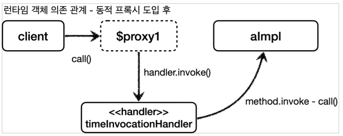
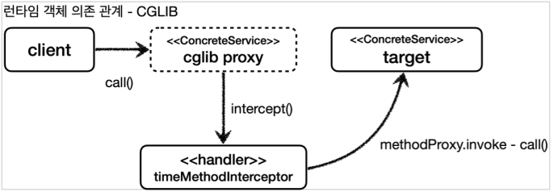

# 동적 프록시 기술
### 들어가기 전에

- 자바가 기본적으로 제공하는 JDK 동적 프록시 기술이나 CGLIB 같은 프록시 생성 오픈소스 기술을 활용하여 프록시 객체를 동적으로 만들어낼 수 있다. 프록시를 적용할 코드를 하나만 만들어두고 동적 프록시 기술을 사용해서 프록시 객체를 찍어내면 된다.
- JDK 동적 프록시를 이해하기 위해서는 리플렉션을 이해해야 한다.
- 리플렉션을 사용하면 클래스와 메서드의 메타 정보를 사용해서 애플리케이션을 동적으로 유연하게 만들 수 있다. 하지만 리플렉션은 런타임에 동작하기 때문에 컴파일 시점에 오류를 잡을 수 없다. (`getMethod(”methodA”)`에서 메서드 이름이 틀리면 컴파일 시점에선 오류가 없다.)
- 리플렉션은 일반적으로 사용하면 안 되고, 프레임워크 개발이나 매우 일반적인 공통 처리가 필요할 때 부분적으로 주의해서 사용해야 한다.

## JDK 동적 프록시

- 동적 프록시 기술을 사용하면 개발자가 직접 프록시 클래스를 만들지 않아도 된다.
- 프록시 객체를 동적으로 런타임에 개발자 대신 만들어 준다.
- **JDK 동적 프록시는 인터페이스를 기반으로 프록시를 동적으로 만들어 준다.**

### JDK 동적 프록시가 제공하는 InvocationHandler

```java
public interface InvocationHandler {
		Object invoke(Object proxy, Method method, Object[] args) throws Throwable;
}
```

- JDK 동적 프록시는 위해 부가 기능을 넣을 인터페이스를 제공한다.
    - `Object proxy` : 프록시 자신
    - `Method method` : 호출한 메서드
    - `Object[] args` : 메서드를 호출할 때 전달한 인수

```java
public class TimeInvocationHandler implements InvocationHandler {

    private final Object target;

    public TimeInvocationHandler(Object target) {
        this.target = target;
    }

    @Override
    public Object invoke(Object proxy, Method method, Object[] args) throws Throwable {
        log.info("TimeProxy 실행");
        long startTime = System.currentTimeMillis();

        Object result = method.invoke(target, args);

        long endTime = System.currentTimeMillis();
        long resultTime = endTime - startTime;
        log.info("TimeProxy 종료 resultTime={}", resultTime);
        return result;
    }
}
```

- `Object target`: 동적 프록시가 호출할 대상
- `method.invoke(target, args)`: 리플렉션을 사용해서 target 인스턴스의 메서드를 실행한다.

```java
AInterface target = new AImpl();

AInterface proxy = (AInterface) Proxy.newProxyInstance(
    AInterface.class.getClassLoader(),
    new Class[]{AInterface.class}, 
		new TimeInvocationHandler(target)
);

proxy.call();
```

- `new TimeInvocationHandler(target)` : 동적 프록시에 적용할 핸들러 로직이다
- `Proxy.newProxyInstance(AInterface.class.getClassLoader(), new Class[]
  {AInterface.class}, handler)`
    - 동적 프록시는 `java.lang.reflect.Proxy`를 통해서 생성할 수 있다.
    - 클래스 로더 정보, 인터페이스, 그리고 핸들러 로직을 넣어주면 된다. 그러면 해당 인터페이스를 기반으로 동적 프록시를 생성하고 그 결과를 반환한다.
  

- 대상 클래스마다 프록시를 만들지 않아도 `InvocationHandler`를 통해 부가 기능만 정의하면 동적으로 프록시 클래스를 만들어낼 수 있다.

## CGLIB

**Code Generator Library**

- CGLIB는 바이트코드를 조작해서 동적으로 클래스를 생성하는 기술을 제공한다.
- CGLIB를 사용하면 인터페이스 없이 구체 클래스만 가지고 동적 프록시를 만들 수 있다.
- CGLIB는 원래 외부 라이브러리지만 스프링 프레임워크가 스프링 내부 소스 코드에 포함했다. 스프링을 사용하면 별도의 라이브러리 추가 없이 사용할 수 있다.
- 참고로 개발자가 직접 CGLIB를 직접 사용하는 경우는 없다.

### CGLIB가 제공하는 MethodInterceptor

```java
public interface MethodInterceptor extends Callback {
    Object intercept(Object var1, Method var2, Object[] var3, MethodProxy var4) throws Throwable;
}
```

- `obj` : CGLIB가 적용된 객체
- `method` : 호출된 메서드
- `args` : 메서드를 호출하면서 전달된 인수
- `proxy` : 메서드 호출에 사용

```java
public class TimeMethodInterceptor implements MethodInterceptor {

    private final Object target;

    public TimeMethodInterceptor(Object target) {
        this.target = target;
    }

    @Override
    public Object intercept(Object obj, Method method, Object[] args, MethodProxy methodProxy) throws Throwable {
        log.info("TimeProxy 실행");
        long startTime = System.currentTimeMillis();

        Object result = methodProxy.invoke(target, args);

        long endTime = System.currentTimeMillis();
        long resultTime = endTime - startTime;
        log.info("TimeProxy 종료 resultTime={}", resultTime);
        return result;
    }
}
```

- JDK 동적 프록시를 설명할 때 예제와 거의 같은 코드이다.
- `Object target` : 프록시가 호출할 실제 대상
- `proxy.invoke(target, args)` : 실제 대상을 동적으로 호출한다.
  - 참고로 method 를 사용해도 되지만, CGLIB는 성능상 `MethodProxy proxy` 를 사용하는 것을
    권장한다.

```java
Enhancer enhancer = new Enhancer();
enhancer.setSuperclass(ConcreteService.class);
enhancer.setCallback(new TimeMethodInterceptor(target));
ConcreteService proxy = (ConcreteService) enhancer.create();

proxy.call();
```

- `Enhancer` : CGLIB는 `Enhancer`를 사용해서 프록시를 생성한다.
- `enhancer.setSuperclass(ConcreteService.class)`
  - CGLIB는 구체 클래스를 상속 받아서 프록시를 생성할 수 있다. 어떤 구체 클래스를 상속 받을지 지정한다.
- `enhancer.setCallback(new TimeMethodInterceptor(target))`
  - 프록시에 적용할 실행 로직을 할당한다.
- `enhancer.create()`
  - 프록시를 생성한다. 앞서 설정한 `enhancer.setSuperclass(ConcreteService.class)`에서 지정한 클래스를 상속 받아서 프록시가 만들어진다.

> CGLIB가 동적으로 생성하는 클래스 이름은 다음과 같은 규칙으로 생성된다.
`대상클래스$$EnhancerByCGLIB$$임의코드`

참고로 다음은 JDK Proxy가 생성한 클래스 이름이다.
`proxyClass=class com.sun.proxy.$Proxy1`
>

### CGLIB 제약

- 부모 클래스의 생성자를 체크해야 한다. CGLIB는 자식 클래스를 동적으로 생성하기 때문에 기본
  생성자가 필요하다.
- 클래스에 final 키워드가 붙으면 상속이 불가능하다. CGLIB에서는 예외가 발생한다.
- 메서드에 final 키워드가 붙으면 해당 메서드를 오버라이딩 할 수 없다. CGLIB에서는 프록시
  로직이 동작하지 않는다.
