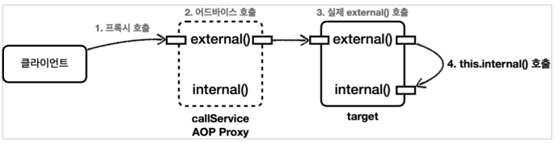
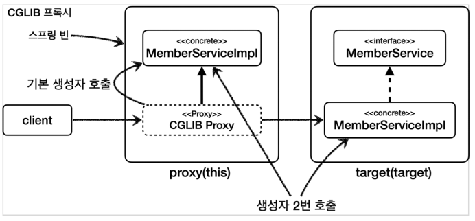

# 스프링 AOP - 실무 주의사항

## 프록시와 내부 호출

- 스프링은 프록시 방식의 AOP를 사용하기 때문에 항상 프록시를 통해서 대상 객체를 호출한다.
- 프록시를 거치지 않고 직접 호출하면 AOP가 적용되지 않는다.
- 대상 객체의 내부에서 메서드 호출이 발생하면 프록시를 거치지 않고 대상 객체를 직접 호출하는 문제가 발생한다

1. 클라이언트에서 callService를 빈 주입 받는데 프록시를 주입 받는다.
2. 클라이언트에서 callService를 호출하면 프록시가 호출되어 어드바이스와 실제 메서드가 잘 수행 된다.
3. 그런데 callService(타겟)이 자기 자신을 내부 호출하게 되면 프록시를 거치는 것이 아니라 실제 메서드를 바로 수행하게 된다.
4. 내부 메서드는 어드바이스가 적용되지 않는다.

> 참고로 스프링 AOP가 아닌 AspectJ를 직접 사용해서 컴파일 타임 위빙이나 로드 타임 위빙을 하면 내부 메서드를 호출해도 어드바이스가 적용된다. 하지만 이 방법은 설정이 복잡하다.
>

### 대안
- 어드바이스를 적용해야 하는 내부 메서드를 외부 클래스로 빼서 구조를 변경한다.
- AOP는 인터페이스에 메서드가 나올 정도의 규모에 적용하는 것이 적당하다. 즉 다른 클라이언트에게 호출당하는 puiblic 메서드에만 적용할 것을 권장한다.

## 프록시 기술과 한계 - 타입 캐스팅과 의존 관계 주입

스프링이 프록시를 만들 때 제공하는 `ProxyFactory`에 `proxyTargetClass` 옵션에 따라 선택해서 프록시를 만들 수 있다.

- `proxyTargetClass=false` - JDK 동적 프록시를 사용
- `proxyTargetClass=true` - CGLIB 프록시 사용
- 옵션과 무관하게 인터페이스가 없으면 CGLIB를 사용한다.

### JDK 동적 프록시 한계

인터페이스 기반인 JDK 동적 프록시는 구체 클래스로 타입 캐스팅이 불가능하다는 한계가 있다.

```java
MemberServiceImpl target = new MemberServiceImpl();
ProxyFactory proxyFactory = new ProxyFactory(target);
proxyFactory.setProxyTargetClass(false); //JDK 동적 프록시

//프록시를 인터페이스로 캐스팅 성공
MemberService memberServiceProxy = (MemberService) proxyFactory.getProxy();

//JDK 동적 프록시를 구현 클래스로 캐스팅 시도 실패, ClassCastException 예외 발생
assertThrows(ClassCastException.class, () -> {
    MemberServiceImpl castingMemberService = (MemberServiceImpl) memberServiceProxy;
});
```

- JDK 동적 프록시는 인터페이스를 기반으로 생성하기 때문에 구체 클래스를 타겟으로 프록시를 만들어도 프록시에서 구체 클래스로 타입 변환을 하지 못한다.
- CGLIB 프록시는 구체 클래스를 상속하여 만들기 때문에 구체 클래스로 캐스팅해도 문제가 없다. 물론 상위인 인터페이스로 캐스팅해도 된다.

### 의존 관계 주입
- JDK 동적 프록시는 인터페이스 기반으로 프록시를 생성하기 때문에 구체 클래스 타입으로 DI를 받을 수 없다. (캐스팅이 불가능하기 때문)
- 인터페이스 기반으로 설계를 해서 구현 클래스 변경을 자유롭게 할 수 있는 환경이라면 이런 문제는 발생하지 않는다.
- 그럼에도 테스트 또는 여러가지 이유로 구체 클래스를 직접 주입 받아야 하는 경우가 있다.
- 이 때는 CGLIB를 통해 AOP를 적용하면 된다.

## CGLIB 단점

CGLIB는 구체 클래스를 상속 받기 때문에 다음과 같은 문제가 있다.

### 대상 클래스에 기본 생성자 필수

- 자바에서 상속을 받으면 자식 클래스의 생성자를 호출할 때 보무 클래스의 생성자도 호출해야 한다.
- CGLIB가 만드는 프록시는 대상 클래스를 상속 받고, 대상 클래스의 기본 생성자를 호출한다.

### 생성자 2번 호출 문제

1. 실제 target의 객체를 생성할 때
2. 프록시 객체를 생성할 때 부모 클래스의 생성자 호출

### fianl 키워드 사용 불가

- final 키워드가 클래스에 있으면 상속이 불가하고, 메서드에 있으면 오버라이드가 불가능하다.
- 프레임워크 같은 개발이 아닌 일반 웹 애플리케이션에선 final 키워드를 잘 사용하지 않아서 특별히 문제가 되진 않는다.

## 스프링의 해결책

### 스프링 3.2, CGLIB를 스프링 내부에 함께 패키징

- 원래 CGLIB 라이브러리를 별도로 필요로 했다.
- CGLIB 라이브러리를 내부에 함께 패키징해서 별도 라이브러리 추가 없이 사용할 수 있다.

### CGLIB 기본 생성자 필수 문제 해결

- 스프링 4.0부터 기본 생성자 필수 문제가 해결되었다.
- `objenesis`라는 라이브러리를 사용해서 기본 생성자 없이 객체 생성이 가능하다.

### 생성자 2번 호출 문제

- 스프링 4.0부터 해결되었다.
- 이것 역시 `objenesis` 덕분에 해결되었다.

### 스프링부트 2.0 - CGLIB 기본 사용

- 인터페이스가 있어도 항상 CGLIB를 사용해서 구체 클래스 기반으로 프록시를 생성한다.
- `spring.aop.proxy-target-class=false` 이 설정으로 JDK를 사용할 수도 있다.
