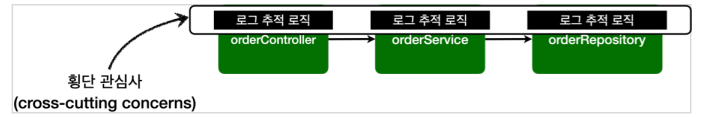

# 스프링 AOP
## 핵심 기능과 부과 기능

애플리케이션의 로직은 크게 핵심 기능과 부가 기능으로 나눌 수 있다.

- **핵심 기능** - 객체가 제공하는 고유의 기능 (OrderService의 주문)
- **부가 기능** - 핵심 기능을 보조하기 위해 제공되는 기능 (로깅, 트랜잭션 기능)

### 횡단 관심사

- 보통 부가 기능은 여러 클래스에 걸쳐서 사용된다.
- 이러한 부가 기능은 **횡단 관심사(cross-cutting concerns)**가 된다.
- 부가 기능 적용의 문제점
    - 많은 반복이 필요하다
    - 코드 중복이 발생한다.
    - 중복 때문에 변경할 때 많은 수정이 필요하다.
    - 부가 기능 적용 대상을 변경할 때 많은 수정이 필요하다.

> 소프트웨어 개발에서 변경 지점은 하나가 될 수 있도록 잘 모듈화 되어야 한다. 그런데 부가 기능처럼 특정 로직을 애플리케이션 전반에 적용하는 문제는 일반적인 OOP로는 해결이 어렵다.
>

## AOP - 애스펙트

### 핵심 기능과 부가 기능을 분리

- 부가 기능과 부가 기능을 어디에 적용할지 선택하는 기능을 합해서 하나의 모듈로 만들었는데 이것이 바로 애스펙트(aspect)이다.
- `@Aspect`가 바로 애스펙트이다. 스프링이 제공하는 어드바이저도 어드바이스(부가 기능)과 포인트컷(적용 대상)을 가지고 있어서 개념상 하나의 애스펙트다.
- 애스펙트를 사용한 프로그래밍 방색을 관점 지향 프로그래밍 **AOP(Aspect-Oriented Programming)**이라고 한다.
- **AOP는 OOP를 대체하기 위한 것이 아니라 횡단 관심사를 깔끔하게 처리하기 어려운 OOP의 부족한 부분을 보조하는 목적으로 개발되었다.**

### AspectJ 프레임워크

AOP의 대표적인 구현으로 AspectJ 프레임워크가 있다. 물론 스프링도 AOP를 지원하지만 대부분 AspectJ 문법을 차용하고, AspectJ가 제공하는 기능의 일부만 제공한다.

## AOP 적용 방식

### 컴파일 시점
- .java 소스 코드를 컴파일러를 사용해서 .class를 만드는 시점에 부가 기능 로직을 추가한다.
- .class 파일을 디컴파일 해보면 애스펙트 관련 호출 코드가 들어간다.
- 단점으로는 특별한 컴파일러도 필요하고 복잡하다.
- AspectJ를 직접 사용해야 한다.
- 애스펙트와 실제 코드를 연결해서 붙이는 것을 **위빙**이라고 한다.

### 클래스 로딩 시점
- 자바를 실행하면 자바는 .class 파일을 JVM 내부 클래스 로더에 보관한다.
- 이 때 중간에서 .class 파일을 조작할 수 있다.
- 이 시점에 애스펙트를 적용하는 것을 **로드 타임 위빙**이라고 한다.
- 단점으로는 자바 실행 시 특별한 옵션(`java-javaagent`)을 통해 로더 조작기를 지정해야 하는데 이 부분이 번거롭고 운영하기 어렵다.
- AspectJ를 직접 사용해야 한다.

### 런타임 시점(프록시)
- 런타임 시점은 컴파일도 끝나고 클래스 로더에 클래스도 다 올라간 다음을 말한다.
- 스프링과 같은 컨테이너의 도움을 받고 프록시와 DI, 빈 포스트 프로세서 같은 개념들을 총 동원해야 한다.
- 특별한 컴파일러나 복잡한 옵션과 클래스 로더 조작기가 필요 없다.
- 단점으로는 프록시를 사용하기 때문에 AOP 기능에 일부 제약이 있다.
    - 프록시 대상 클래스는 final 키워드를 붙일 수 없다. (상속이 가능해야 하기 때문)
    - 메서드 호출 시점에만 부가 기능을 적용할 수 있어서 생성자 같은 곳에는 부가 기능을 넣을 수 없다.
    - 스프링 컨테이너가 관리할 수 있는 스프링 빈에만 AOP를 적용할 수 있다.
- 스프링 AOP는 이 방식을 사용한다.

### AOP 적용 위치

- 적용 가능 지점(조인 포인트): 생성자, 필드 값 접근, static 메서드 접근, 메서드 실행
- AspectJ를 사용하면 실제 바이트 코드를 조작하기 때문에 모든 조인 포인트에 부가 기능을 적용할 수 있다.
- 때문에  프록시 기반의 **스프링 AOP에서는 메서드 실행 지점에만 AOP를 지정할 수 있다.**
    - 프록시는 메서드 오버라이딩 개념으로 동작한다. 따라서 생성자나 static 메서드, 필드 값 접근에는 프록시 개념이 적용될 수 없다.

> **스프링 AOP 보다 더 기능이 많은 AspectJ를 직접 사용하는 것이 좋지 않을까?**
AspectJ는 공부할 내용도 많고 자바 관련 설정도 복잡하지만 스프링 AOP는 별도의 추가 자바 설정 없이 스프링만 있으면 AOP를 적용할 수 있다. 스프링이 제공하는 AOP 기능만 사용해도 대부분의 문제를 해결할 수 있다.
>

## AOP 용어 정리
- **조인 포인트(Join Point)**
    - 어드바이스가 적용될 수 있는 위치
    - 메서드 실행, 생성자 호출, 필드 접근, static 메서드 접근 등
    - 추상적인 개념으로 AOP를 적용할 수 있는 모든 지점
    - 스프링 AOP에서는 프록시 방식을 사용하므로 항상 메서드 실행 지점으로 제한
- **포인트컷(Pointcut)**
    - 조인 포인트 중에서 어드바이스가 적용될 위치를 선별하는 기능
    - 주로 AspectJ 표현식을 사용해서 지정
    - 스프링 AOP에서는 메서드 실행 지점만 포인트컷으로 선별 가능
- **타겟(Target)**
    - 어드바이스를 받는 객체, 포인트컷으로 결정
- **어드바이스(Advice)**
    - 부가 기능
    - 특정 조인 포인트에서 Aspect에 의해 취해지는 조치
    - Around, Before, After와 같은 다양한 종류의 어드바이스가 있음
- **애스펙트(Aspect)**
    - 어드바이스 + 포인트컷을 모듈화한 것
    - `@Aspect`
    - 여러 어드바이스와 포인트컷이 함께 존재
- **어드바이저(Advisor)**
    - 하나의 어드바이스와 하나의 포인트컷으로 구성
    - 스프링 AOP에서만 사용되는 용어
- **위빙(Weaving)**
    - 포인트컷으로 결정한 타겟의 조인 포인트에 어드바이스를 적용하는 것
    - 핵심 기능 코드에 영향을 주지 않고 부가 기능을 추가할 수 있음
- **AOP 프록시**
    - AOP 기능을 구현하기 위해 만든 프록시 객체, 스프링에서 AOP 프록시는 JDK 동적 프록시 또는 CGLIB 프록시다.
