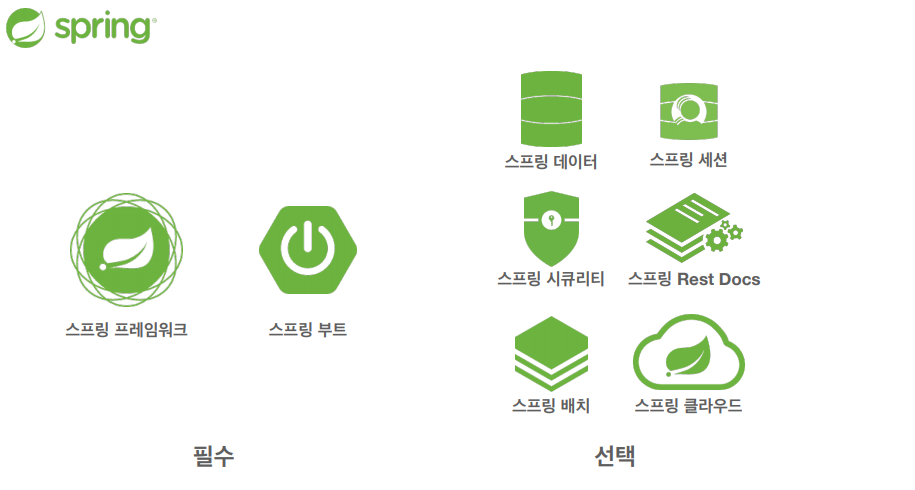

# 스프링이란?

## **스프링 프레임워크**

- 핵심 기술: 스프링 DI 컨테이너, AOP, 이벤트, 기타
- 웹 기술: 스프링 MVC, 스프링 WebFlux
- 데이터 접근 기술: 트랜잭션, JDBC, ORM 지원, XML 지원
- 기술 통합: 캐시, 이메일, 원격접근, 스케줄링
- 테스트: 스프링 기반 테스트 지원
- 언어: 코틀린, 그루비
- 최근에는 스프링 부트를 통해서 스프링 프레임워크의 기술들을 편리하게 사용

본 자료에서는 핵심 기술에 초점이 맞춰져 있음

## **스프링 부트**

- **스프링을 편리하게 사용할 수 있도록 지원, 최근에는 기본으로 사용**
- 단독으로 실행할 수 있는 스프링 애플리케이션을 쉽게 생성
- Tomcat 같은 웹 서버를 내장해서 별도의 웹 서버를 설치하지 않아도 됨
- 손쉬운 빌드 구성을 위한 starter 종속성 제공
    - 하나의 라이브러리를 가져오면 종속된 다른 라이브러리도 자동으로 가져와 줌
- 스프링과 3rd parth(외부) 라이브러리 자동 구성
    - 스프링과 외부 라이브러리의 버전 궁합을 다 체크해서 적절한 버전으로 세팅해준다. (옛날에는 수동으로 하다가 버전 궁합이 안맞아서 안 되는 경우가 많았음)
- 메트릭, 상태 확인, 외부 구성 같은 프로덕션 준비 기능 제공
- 관례에 의한 간결한 설정
    - 필요할 때 설정을 변경하면 됨. 대부분 기본 값 사용

## 스프링 단어?

- 스프링이라는 단어는 문맥에 따라 다르게 사용된다.
    - 스프링 DI 컨테이너 기술
    - 스프링 프레임워크
    - 스프링 부트, 스프링 프레임워크 등을 모두 포함한 스프링 생태계

### 핵심 개념

이 기술을 왜 만들었는가?

이 기술의 핵심 컨셉은?

로드 존슨의 의도는 무엇이었을까

## 스프링의 진짜 핵심

- 스프링은 자바 언어 기반의 프레임워크
- 자바 언어의 가장 큰 특징 - **객체 지향 언어**
- 스프링은 객체 지향 언어가 가진 강력한 특징을 살려내는 프레임워크
- 스프링은 **좋은 객체 지향** 애플리케이션을 개발할 수 있게 도와주는 프레임워크

## 객체 지향 설계와 스프링

- 스프링은 다음 기술로 다형성 **+ OCP, DIP를 가능하게 지원**
    - DI(Dependency Injection): 의존관계, 의존성 주입
    - DI 컨테이너 제공
- **클라이언트 코드의 변경 없이 기능 확장**
- 쉽게 부품을 교체하듯이 개발
- 하지만 인터페이스를 도입하면 추상화 비용 발생.

확장 가능성이 없다면 구체 클래스를 직접 사용
