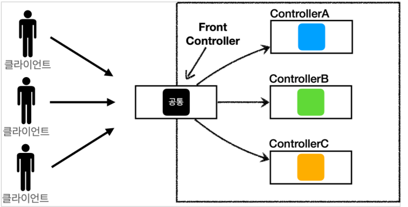

# 스프링 MVC 구조

## MVC 패턴 - 개요

### MVC 필요성

- **너무 많은 역할**
    - 한 곳에서 비즈니스 로직과 뷰 렌더링까지 모두 처리하게 되면 너무 많은 역할을 하게 되고 유지보수가 어려워 진다.
- **변경의 라이프 사이클**
    - UI를 수정하는 일과 비즈니스 로직을 수정하는 일은 각각 다르게 발생할 가능성이 매우 높고 대부분 서로 영향을 주지 않는다.
- **기능 특화**
    - JSP 같은 뷰 템플릿은 화면을 렌더링 하는데 최적화 되어 있기 때문에 이 부분만 담당하는 것이 가장 효과적이다.
- **Model View Controller**
    - **Contorller:** HTTP 요청을 받아 파라미터를 검증하고, 비즈니스 로직을 실행해서 뷰에 전달할 데이터를 모델에 담는다.
    - **Model:** 뷰에 출력할 데이터를 담아둔다. 뷰를 그리는 데 필요한 데이터가 모두 들어있기 때문에 뷰는 비즈니스 로직이나 데이터 접근 방식을 몰라도 되고 렌더링에만 집중할 수 있다.
    - **View**: 모델의 데이터를 사용해서 화면을 그리는 일에 집중한다.

### 스프링 MVC 이전의 문제점

스프링 MVC 이전에는 공통 처리가 어렵다는 문제가 있었다.

- **포워드 코드 중복**

```java
RequestDispatcher dispatcher = request.getRequestDispatcher(viewPath);
dispatcher.forward(request, response);
```

- **View Path 중복**
    - `String viewPath = "/WEB-INF/views/new-form.jsp";`
    - 그리고 만약 jsp가 아닌 thymeleaf 같은 다른 뷰로 변경한다면 전체 코드를 다 변경해야 한다
- **사용하지 않는 코드**
    - 예를 들어 서블릿 파라미터로 받는 HttpRequest와 HttpResponse를 다 사용하지 않을 때도 있다.

기능이 복잡해질 수 록 컨트롤러에서 공통으로 처리해야 하는 부분이 점점 더 많이 증가할 것이다. 공통 기능을 한 번에 처리할 수 없을까?

## 프론트 컨트롤러 패턴


- 프론트 컨트롤러 서블릿 하나로 클라이언트의 요청을 받음
- 프론트 컨트롤러가 요청에 맞는 컨트롤러를 찾아서 호출
- 공통 처리 가능
- 프론트 컨트롤러를 제외한 나머지 컨트롤러는 서블릿을 사용하지 않아도 됨
- 스프링 웹 MVC의 DispatcherServlet이 FrontController 패턴으로 구현되어 있음

## 스프링 MVC 구조


- `DispatcherServlet`
- `HandlerMapping`
- `HandlerAdapter`
- `ModelAndView`
- `ViewResolver`
- `View`

### DispatcherServlet 구조 살펴 보기

`org.springframework.web.servlet.DispatcherServlet`

상속 구조 - `DispatcherServlet` → `FrameworkServlet` → `HttpServletBean` → `HttpServlet`

**요청 흐름**

1. 서블릿이 호출되면 `HttpServlet`이 제공하는 `serivce()`가 호출된다.
2. 스프링 MVC는 `DispatcherServlet`의 부모인 `FrameworkServlet`에서 `service()`를 오버라이드
   해두었다.
3. `FrameworkServlet.service()`를 시작으로 여러 메서드가 호출되면서 `DispacherServlet.doDispatch()`가 호출된다.

### `DispacherServlet.doDispatch()`

핵심만 요약한 소스 코드

```java
protected void doDispatch(HttpServletRequest request, HttpServletResponse response) 
																															throws Exception {
   HttpServletRequest processedRequest = request;
   HandlerExecutionChain mappedHandler = null;
   boolean multipartRequestParsed = false;

   WebAsyncManager asyncManager = WebAsyncUtils.getAsyncManager(request);

   try {
      ModelAndView mv = null;
      Exception dispatchException = null;

      try {
         processedRequest = checkMultipart(request);
         multipartRequestParsed = (processedRequest != request);

         **// 1. 핸들러 조회
         mappedHandler = getHandler(processedRequest);**
         if (mappedHandler == null) {
            noHandlerFound(processedRequest, response);
            return;
         }

         **// 2. 핸들러 어댑터 조회
         HandlerAdapter ha = getHandlerAdapter(mappedHandler.getHandler());**

         if (!mappedHandler.applyPreHandle(processedRequest, response)) {
            return;
         }

         **// 3. 핸들러 어댑터 실행 -> 4. 어댑터로 핸들러 실행 -> 5. ModelAndView 반환
         mv = ha.handle(processedRequest, response, mappedHandler.getHandler());**

         applyDefaultViewName(processedRequest, mv);
         mappedHandler.applyPostHandle(processedRequest, response, mv);
      }
      catch (Exception ex) {
         dispatchException = ex;
      }
      catch (Throwable err) {
         dispatchException = new NestedServletException("Handler dispatch failed", err);
      }
			// 결과 처리
      processDispatchResult(processedRequest, response, mappedHandler, mv, dispatchException);
 
// ...  
}

private void processDispatchResult(
			HttpServletRequest request, HttpServletResponse response,
			@Nullable HandlerExecutionChain mappedHandler, @Nullable ModelAndView mv,
			@Nullable Exception exception) throws Exception {

		boolean errorView = false;

		if (mv != null && !mv.wasCleared()) {
			**// 뷰 렌더링 호출
			render(mv, request, response);**
			if (errorView) {
				WebUtils.clearErrorRequestAttributes(request);
			}
		}
		else {
			if (logger.isTraceEnabled()) {
				logger.trace("No view rendering, null ModelAndView returned.");
			}
		}
}

protected void render(
						ModelAndView mv, HttpServletRequest request, HttpServletResponse response
) throws Exception {

		Locale locale =
				(this.localeResolver != null ? this.localeResolver.resolveLocale(request) : request.getLocale());
		response.setLocale(locale);

		View view;
		String viewName = mv.getViewName();
		if (viewName != null) {
			**// 6. 뷰 리졸버를 통해 뷰 찾기, 7. View 반환
			view = resolveViewName(viewName, mv.getModelInternal(), locale, request);**
			if (view == null) {
				throw new ServletException("Could not resolve view with name '" + mv.getViewName() + "' in servlet with name '" + getServletName() + "'");
			}
		}
		else {
			view = mv.getView();
			if (view == null) {
				throw new ServletException("ModelAndView [" + mv + "] neither contains a view name nor a " + "View object in servlet with name '" + getServletName() + "'");
			}
		}
		try {
			if (mv.getStatus() != null) {
				request.setAttribute(View.RESPONSE_STATUS_ATTRIBUTE, mv.getStatus());
				response.setStatus(mv.getStatus().value());
			}
			**// 8. 뷰 렌더링
			view.render(mv.getModelInternal(), request, response);**
		}
		catch (Exception ex) {
			if (logger.isDebugEnabled()) {
				logger.debug("Error rendering view [" + view + "]", ex);
			}
			throw ex;
		}
	}
```

1. **핸들러 조회**: 핸들러 매핑을 통해 요청 URL에 매핑된 핸들러(컨트롤러)를 조회한다.
2. **핸들러 어댑터 조회**: 핸들러를 실행할 수 있는 핸들러 어댑터를 조회한다.
3. **핸들러 어댑터 실행**: 핸들러 어댑터를 실행한다.
4. **핸들러 실행**: 핸들러 어댑터가 실제 핸들러를 실행한다.
5. **ModelAndView 반환**: 핸들러 어댑터는 핸들러가 반환하는 정보를 ModelAndView로 변환해서
   반환한다.
6. **viewResolver 호출**: 뷰 리졸버를 찾고 실행한다.
  1. JSP의 경우: `InternalResourceViewResolver`가 자동 등록되고, 사용된다.
7. **View 반환**: 뷰 리졸버는 뷰의 논리 이름을 물리 이름으로 바꾸고, 렌더링 역할을 담당하는 뷰 객체를 반환한다.
  1. JSP의 경우 `InternalResourceView(JstlView)`를 반환하는데, 내부에 `forward()` 로직이 있다.
8. **뷰 렌더링**: 뷰를 통해서 뷰를 렌더링 한다.

## 핸들러 매핑과 핸들러 어댑터

컨트롤러가 호출되려면 다음 2가지가 필요하다.

- **HandlerMapping(핸들러 매핑)**
  - 핸들러 매핑에서 이 컨트롤러를 찾을 수 있어야 한다.
  - 예) 스프링 빈의 이름으로 핸들러를 찾을 수 있는 핸들러 매핑이 필요하다.
- **HandlerAdapter(핸들러 어댑터)**
  - 핸들러 매핑을 통해서 찾은 핸들러를 실행할 수 있는 핸들러 어댑터가 필요하다.
  - 예) `Controller` 인터페이스를 실행할 수 있는 핸들러 어댑터를 찾고 실행해야 한다.
- **스프링 부트가 자동 등록하는 핸들러 매핑과 핸들러 어댑터**
  - **HandlerMapping**
    - `RequestMappingHandlerMapping` : 애노테이션 기반의 컨트롤러인 `@RequestMapping`에서 사용
    - `BeanNameUrlHandlerMapping` : 스프링 빈의 이름으로 핸들러를 찾는다.
  - **HandlerAdapter**
    - `RequestMappingHandlerAdapter` : 애노테이션 기반의 컨트롤러인 `@RequestMapping`에서 사용
    - `HttpRequestHandlerAdapter` : `HttpRequestHandler` 처리
    - `SimpleControllerHandlerAdapter` : `Controller` 인터페이스(애노테이션X, 과거에 사용)
      처리
- `**@RequestMapping**`
  - 가장 우선순위가 높은 핸들러 매핑과 핸들러 어댑터는 `RequestMappingHandlerMapping` ,
    `RequestMappingHandlerAdapter`이다. `@RequestMapping`의 앞글자를 따서 만든 이름인데, 이것이 바로 지금 스프링에서 주로 사용하는 애노테이션 기반의 컨트롤러를 지원하는 매핑과 어댑터이다. 실무에서는 99.9% 이 방식의 컨트롤러를 사용한다.

## 정리

- 스프링 MVC의 큰 강점은 `DispatcherServlet` 코드의 변경 없이, 원하는 기능을 변경하거나 확장할 수 있다는 점이다.
- 지금까지 설명한 대부분을 확장 가능할 수 있게 인터페이스로 제공한다.
  - `HanderMapping`, `HandlerAdapter` 등등
- 인터페이스들만 구현해서 `DispatcherServlet`에 등록하면 커스텀 컨트롤러도 구현할 수 있다.
  - 하지만 스프링 MVC에는 필요한 기능 대부분이 다 구현되어 있어 확장할 일이 많이 없다.
  - 그래도 핵심 동작 방식을 알아 두어야 문제가 발생했을 때 해결하기 용이하다.
