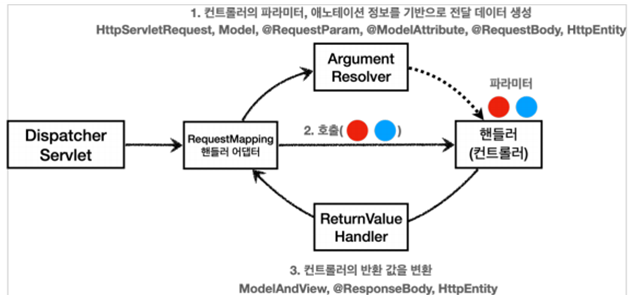

# 스프링 MVC 기본 기능
## **요청 매핑**

- **`@Controller`**는 반환 값이 String이면 뷰 이름으로 인식된다. 그래서 뷰를 찾고 뷰가 랜더링 된다.
- **`@RestController`**는 반환 값으로 뷰를 찾는 것이 아니라, HTTP 메시지 바디에 바로 입력한다.
    - /hello-basic URL 호출이 오면 이 메서드가 실행되도록 매핑한다.
    - 다중 설정이 가능하다. {"/hello-basic", "/hello-go"}
- 다음 두 가지 요청은 다른 URL이지만, 스프링은 다음 URL 요청들을 같은 요청으로 매핑한다.
    - 매핑: /hello-basic
    - URL 요청: /hello-basic , /hello-basic/

### **PathVariable(경로 변수) 사용**

```java
@GetMapping("/mapping/{userId}") 
public String mappingPath(@PathVariable("userId") String data)
```

- (`@PathVariable("userId") String userId`) -> `@PathVariable userId`
- 변수명이 같으면 생략 가능
- 다중 사용 가능

```java
@GetMapping("/mapping/users/{userId}/orders/{orderId}") 
public String mappingPath(@PathVariable String userId, @PathVariable Long orderId)
```

### **미디어 타입 조건 매핑 - HTTP 요청 Content-Type, consume**

```java
@PostMapping(value = "/mapping-consume", consumes = "application/json")
```

- Content-Type 헤더 기반 추가 매핑 Media Type
- consumes="application/json"
- consumes="!application/json"
- consumes="application/*"
- consumes="*\/*"
- MediaType.APPLICATION_JSON_VALUE
- */
- HTTP 요청의 Content-Type 헤더를 기반으로 미디어 타입으로 매핑
- 만약 맞지 않으면 HTTP 415 상태코드(Unsupported Media Type)을 반환

### **미디어 타입 조건 매핑 - HTTP 요청 Accept, produce**

```java
@PostMapping(value = "/mapping-produce", produces = "text/html")
```

- HTTP 요청의 Accept 헤더를 기반으로 미디어 타입으로 매핑한다.
- 만약 맞지 않으면 HTTP 406 상태코드(Not Acceptable)을 반환한다

> **Content-Type 헤더**와 **Accept 헤더** 둘 다 데이터 타입(MIME)을 다루는 헤더이다. 하지만 **Content-Type 헤더**는 현재 전송하는 데이터가 어떤 타입인지에 대한 설명을 하는 개념이고, **Accept 헤더**는 클라이언트가 서버에게 어떤 특정한 데이터 타입을 보낼 때 클라이언트가 보낸 특정 데이터 타입으로만 응답을 해야한다.
>

### **HTTP 요청 - 기본, 헤더 조회**

애노테이션 기반의 스프링 컨트롤러는 다양한 파라미터를 지원한다.

- `HttpServletRequest`
- `HttpServletResponse`
- `HttpMethod` : HTTP 메서드를 조회한다. org.springframework.http.HttpMethod
- `Locale` : Locale 정보를 조회한다.
- `@RequestHeader MultiValueMap<String, String> headerMap`
    - 모든 HTTP 헤더를 MultiValueMap 형식으로 조회한다.
- `@RequestHeader("host") String host`
    - 특정 HTTP 헤더를 조회한다.
    - 속성
        - 필수 값 여부: `required`
        - 기본 값 속성: `defaultValue`
- `@CookieValue(value = "myCookie", required = false) String cookie`
    - 특정 쿠키를 조회한다.
    - 속성
    - 필수 값 여부: required
    - 기본 값: defaultValue

## **HTTP 요청 파라미터 - 쿼리 파라미터, HTML Form**

클라이언트에서 서버로 요청 데이터를 전달할 때는 주로 다음 3가지 방법을 사용한다.

- GET - 쿼리 파라미터
    - `/url?username=hello&age=20`
    - 메시지 바디 없이, URL의 쿼리 파라미터에 데이터를 포함해서 전달
    - 예) 검색, 필터, 페이징등에서 많이 사용하는 방식
- POST - HTML Form
    - `content-type: application/x-www-form-urlencoded`
    - 메시지 바디에 쿼리 파리미터 형식으로 전달 `username=hello&age=20`
    - 예) 회원 가입, 상품 주문, HTML Form 사용
- HTTP message body에 데이터를 직접 담아서 요청
    - HTTP API에서 주로 사용, JSON, XML, TEXT
    - 데이터 형식은 주로 JSON 사용
    - POST, PUT, PATCH

GET 쿼리 파리미터 전송 방식이든, POST HTML Form 전송 방식이든 둘 다 형식이 같으므로 구분 없이 조회할 수 있다.

이것을 간단히 **요청 파라미터(request parameter) 조회**라 한다.

## **HTTP 요청 파라미터 - @RequestParam**

스프링이 제공하는 `@RequestParam`을 사용하면 요청 파라미터를 매우 편리하게 사용할 수 있다

```java
@RequestMapping("/request-param-v2") 
public String requestParamV2(@RequestParam("username") String memberName,
														 @RequestParam("age") int age)
```

HTTP 파라미터 이름이 변수 이름과 같으면 `@RequestParam(name="xx")` 생략 가능

```java
public String requestParamV4(String username, int age)
```

- 이렇게 애노테이션을 완전히 생략해도 되는데, 너무 없는 것도 약간 과하다는 주관적 생각이 있다.
- `@RequestParam`이 있으면 명확하게 요청 파리미터에서 데이터를 읽는다는 것을 알 수 있다.

### **파라미터 필수 여부 - requestParamRequired**

```java
@RequestMapping("/request-param-required") 
public String requestParamRequired(@RequestParam(required = false) String username,   
																	 @RequestParam(required = false) int age)
```

- `@RequestParam.required`
    - 파라미터 필수 여부
    - 기본값이 파라미터 필수( true )이다.
- /request-param 요청
    - username이 없으므로 400 예외가 발생한다.
- 주의! - 파라미터 이름만 사용
    - `/request-param?username=`
    - 파라미터 이름만 있고 값이 없는 경우 빈문자로 통과
- 주의! - 기본형(primitive)에 null 입력
    - `/request-param` 요청
    - `@RequestParam(required = false) int age`
    - null을 int에 입력하는 것은 불가능(500 예외 발생)
    - 따라서 null을 받을 수 있는 `Integer`로 변경하거나, 또는 다음에 나오는 `defaultValue` 사용

### **기본 값 적용 - requestParamDefault**

```java
@RequestMapping("/request-param-default") 
public String requestParamDefault(@RequestParam(defaultValue = "guest") String username,  
																  @RequestParam(defaultValue = "-1") int age)
```

- 파라미터에 값이 없는 경우 `defaultValue`를 사용하면 기본값을 적용할 수 있다.
- 이미 기본 값이 있기 때문에 `required`는 의미가 없다.
- `defaultValue`는 빈 문자의 경우에도 설정한 기본값이 적용된다.

### **파라미터를 Map으로 조회하기 - requestParamMap**

```java
@RequestMapping("/request-param-map") 
public String requestParamMap(@RequestParam Map<String, Object> paramMap) {  
			*log*.info("username={}, age={}", paramMap.get("username"), paramMap.get("age"));
```

- 파라미터의 값이 1개가 확실하다면 Map을 사용해도 되지만, 그렇지 않다면 MultiValueMap을 사용하자

## **HTTP 요청 파라미터 - @ModelAttribute**

실제 개발을 하면 요청 파라미터를 받아서 필요한 객체를 만들고 그 객체에 값을 넣어주어야 한다.

스프링은 이 과정을 완전히 자동화해주는 `@ModelAttribute` 기능을 제공한다.

```java
@RequestMapping("/model-attribute-v1") 
public String modelAttributeV1(@ModelAttribute HelloData helloData) {  
				*log*.info("username={}, age={}", helloData.getUsername(), helloData.getAge());
```

스프링MVC는 `@ModelAttribute`가 있으면 다음을 실행한다.

- `HelloData` 객체를 생성한다.
- 요청 파라미터의 이름으로 `HelloData` 객체의 프로퍼티를 찾는다. 그리고 해당 프로퍼티의 `setter`를 호출해서 파라미터의 값을 입력(바인딩) 한다.
- 예) 파라미터 이름이 `username`이면 `setUsername()` 메서드를 찾아서 호출하면서 값을 입력한다.

### **@ModelAttribute 생략 - modelAttributeV2**

```java
public String modelAttributeV2(HelloData helloData) {
				*log*.info("username={}, age={}", helloData.getUsername(), helloData.getAge());
```

스프링은 해당 생략시 다음과 같은 규칙을 적용한다.

- `String` , `int` , `Integer` 같은 단순 타입 = `@RequestParam`
- 나머지 = `@ModelAttribute` (argument resolver로 지정해둔 타입 외)

### **@ModelAttribute – model.addAttribute 생략**

```java
@PostMapping("/add") 
public String addItemV2(@ModelAttribute("item") Item item) {   
				itemRepository.save(item);  
				//model.addAttribute("item", item);
```

- `@ModelAttribute`는 중요한 한 가지 기능이 더 있는데, 바로 모델(Model)에 `@ModelAttribute`로 지정한 객체를 자동으로 넣어준다.
- 모델에 데이터를 담을 때는 이름이 필요하다. 이름은 `@ModelAttribute`에 지정한 `name(value)` 속성을 사용한다.
- `@ModelAttribute`의 이름을 생략할 수 있다.
- 클래스의 첫 글자만 소문자로 변경해서 등록 (Item -> item)

## **HTTP 요청 메시지 - 단순 텍스트**

요청 파라미터와 다르게, HTTP 메시지 바디를 통해 데이터가 직접 데이터가 넘어오는 경우는 `@RequestParam` , `@ModelAttribute`를 사용할 수 없다. (물론 HTML Form 형식으로 전달되는 경우는 요청 파라미터로 인정된다.)

### **@RequestBody - requestBodyStringV4**

```java
@ResponseBody @PostMapping("/request-body-string-v4") 
public String requestBodyStringV4(@RequestBody String messageBody) throws IOException {
				*log*.info("messageBody={}", messageBody);   return "ok"; 
}
```

**@RequestBody**

- `@RequestBody`를 사용하면 HTTP 메시지 바디 정보를 편리하게 조회할 수 있다.
- 참고로 헤더 정보가 필요하다면 `HttpEntity`를 사용하거나 `@RequestHeader`를 사용하면 된다.
- 이렇게 메시지 바디를 직접 조회하는 기능은 요청 파라미터를 조회하는 `@RequestParam`, `@ModelAttribute`와는 전혀 관계가 없다.

**@ResponseBody**

`@ResponseBody`를 사용하면 응답 결과를 HTTP 메시지 바디에 직접 담아서 전달할 수 있다. 물론 이 경우에도 view를 사용하지 않는다.

## **HTTP 요청 메시지 - JSON**

### **requestBodyJsonV2 - @RequestBody 문자 변환**

```java
@ResponseBody @PostMapping("/request-body-json-v2") 
public String requestBodyJsonV2(@RequestBody String messageBody) throws IOException {   
				*log*.info("messageBody={}", messageBody);  
				HelloData data = objectMapper.readValue(messageBody, HelloData.class);  
				*log*.info("username={}, age={}", data.getUsername(), data.getAge());   
				return "ok"; 
}
```

- 문자로 된 JSON 데이터를 Jackson 라이브러리인 `objectMapper`를 사용해서 자바 객체로 변환한다.
    - messageBody={"username":"hello", "age":24}
    - username=hello, age=24

### **requestBodyJsonV3 - @RequestBody 객체 변환**

```java
@ResponseBody @PostMapping("/request-body-json-v3") 
public String requestBodyJsonV3(@RequestBody HelloData helloData) throws IOException {   
				*log*.info("username={}, age={}", helloData.getUsername(), helloData.getAge());   
				return "ok"; 
}
```

`@RequestBody` 객체 파라미터

- `@RequestBody HelloData data`
- `@RequestBody`에 직접 만든 객체를 지정할 수 있다

**@RequestBody는 생략 불가능**

`@ModelAttribute`에서 학습한 내용을 떠올려보자.

스프링은 `@ModelAttribute` , `@RequestParam` 해당 생략 시 다음과 같은 규칙을 적용한다.

- String , int , Integer 같은 단순 타입 = @RequestParam
- 나머지 = @ModelAttribute (argument resolver 로 지정해둔 타입 외)

따라서 이 경우 `HelloData`에 `@RequestBody`를 생략하면 `@ModelAttribute`가 적용되어버린다.

`HelloData data` -> `@ModelAttribute HelloData data`

따라서 생략하면 HTTP 메시지 바디가 아니라 요청 파라미터를 처리하게 된다.

### **requestBodyJsonV5**

```java
@ResponseBody 
@PostMapping("/request-body-json-v5")
public HelloData requestBodyJsonV5(@RequestBody HelloData data) {  
				*log*.info("username={}, age={}", data.getUsername(), data.getAge());  
				return data; 
}
```

**@ResponseBody**

응답의 경우에도 `@ResponseBody`를 사용하면 해당 객체를 HTTP 메시지 바디에 직접 넣어줄 수 있다

- `@RequestBody` 요청
    - JSON 요청 -> HTTP 메시지 컨버터 -> 객체
- `@ResponseBody` 응답
    - 객체 -> HTTP 메시지 컨버터 -> JSON 응답

## **HTTP 응답 - 정적 리소스, 뷰 템플릿**

스프링(서버)에서 응답 데이터를 만드는 방법은 크게 3가지이다.

- 정적 리소스
    - 예) 웹 브라우저에 정적인 HTML, css, js을 제공할 때는, 정적 리소 스를 사용한다.
- 뷰 템플릿 사용
    - 예) 웹 브라우저에 동적인 HTML을 제공할 때는 뷰 템플릿을 사용
- HTTP 메시지 사용
    - HTTP API를 제공하는 경우에는 HTML이 아니라 데이터를 전달해야 하므로, HTTP 메시지 바디에 JSON 같은 형식으로 데이터를 보낸다.

### **정적 리소스**

다음 경로에 파일이 들어있으면

`src/main/resources/static/basic/hello-form.html`

웹 브라우저에서 다음과 같이 실행하면 된다.

`http://localhost:8080/basic/hello-form.html`

정적 리소스는 해당 파일을 변경 없이 그대로 서비스하는 것이다.

### **뷰 템플릿**

뷰 템플릿을 거쳐서 HTML이 생성되고, 뷰가 응답을 만들어서 전달한다.

일반적으로 HTML을 동적으로 생성하는 용도로 사용하지만, 다른 것들도 가능하다. 뷰 템플릿이 만들 수 있는 것이라면 뭐든지 가능하다.

**String을 반환하는 경우 - View or HTTP 메시지**

```java
@RequestMapping("/response-view-v2") 
public String responseViewV1(Model model) {  
				model.addAttribute("data", "hello!");  
				return "/response/hello"; 
}
```

- `@ResponseBody`가 없으면 response/hello로 **뷰 리졸버**가 실행되어서 뷰를 찾고, 렌더링 한다.
- `@ResponseBody`가 있으면 뷰 리졸버를 실행하지 않고, HTTP 메시지 바디에 직접 response/hello라는 문자가 입력된다.
- 여기서는 뷰의 논리 이름인 response/hello를 반환하면 다음 경로의 뷰 템플릿이 렌더링 되는 것을 확인할 수 있다.

## **HTTP 응답 - HTTP API, 메시지 바디에 직접 입력**

HTTP API를 제공하는 경우에는 HTML이 아니라 데이터를 전달해야 하므로, HTTP 메시지 바디에 JSON 같은 형식으로 데이터를 실어 보낸다

### **HTTP 메시지 컨버터**

뷰 템플릿으로 HTML을 생성해서 응답하는 것이 아니라, HTTP API처럼 JSON 데이터를 HTTP 메시지 바디에서 직접 읽거나 쓰는 경우 HTTP 메시지 컨버터를 사용하면 편리하다


**`@ResponseBody` 사용 원리**

- `@ResponseBody`를 사용
  - HTTP의 BODY에 문자 내용을 직접 반환
  - `viewResolver` 대신에 `HttpMessageConverter`가 동작
  - 기본 문자처리: `StringHttpMessageConverter`
  - 기본 객체처리: `MappingJackson2HttpMessageConverter`
  - byte 처리 등등 기타 여러 `HttpMessageConverter`가 기본으로 등록 되어 있음

스프링 MVC는 다음의 경우에 HTTP 메시지 컨버터를 적용한다.

- HTTP 요청: `@RequestBody`, `HttpEntity(RequestEntity)`
- HTTP 응답: `@ResponseBody`, `HttpEntity(ResponseEntity)`

스프링 부트는 다양한 메시지 컨버터를 제공하는데, 대상 **클래스 타입**과 **미디어 타입** 둘을 체크해서 사용 여부를 결정한다. 만약 만족하지 않으면 다음 메시지 컨버터로 우선순위가 넘어간다.

**몇 가지 주요한 메시지 컨버터**

- `ByteArrayHttpMessageConverter` : byte[] 데이터를 처리한다
  - 클래스 타입: `byte[]` , 미디어타입: */* ,
  - 요청 예) `@RequestBody byte[] data`
  - 응답 예) `@ResponseBody return byte[]` 쓰기 미디어타입 application/octet-stream
- `StringHttpMessageConverter` : `String` 문자로 데이터를 처리한다.
  - 클래스 타입: `String`, 미디어타입: `*/*`
  - 요청 예) `@RequestBody String data`
  - 응답 예) `@ResponseBody return "ok"` 쓰기 미디어타입 text/plain
- `MappingJackson2HttpMessageConverter` : application/json
  - 클래스 타입: 객체 또는 `HashMap`, 미디어타입 application/json
  - 요청 예) `@RequestBody HelloData data`
  - 응답 예) `@ResponseBody return helloData` 쓰기 미디어타입 application/json 관련

**HTTP 요청 데이터 읽기**

- HTTP 요청이 오고, 컨트롤러에서 `@RequestBody`, `HttpEntity` 파라미터를 사용한다.
- 메시지 컨버터가 메시지를 읽을 수 있는지 확인하기 위해 `canRead()` 를 호출한다.
  - 대상 클래스 타입을 지원하는가.

    ` • 예) `@RequestBody`의 대상 클래스 (`byte[]`, `String`,  `HelloData`)

  - HTTP 요청의 `Content-Type` 미디어 타입을 지원하는가.
    - 예) text/plain , application/json , */*
- `canRead()` 조건을 만족하면 `read()`를 호출해서 객체 생성하고, 반환한다

**HTTP 응답 데이터 생성**

- 컨트롤러에서 `@ResponseBody` , `HttpEntity`로 값이 반환된다.
- 메시지 컨버터가 메시지를 쓸 수 있는지 확인하기 위해 `canWrite()`를 호출한다.
  - 대상 클래스 타입을 지원하는가.
    - 예) return의 대상 클래스 ( `byte[]` , `String` , `HelloData` )
  - HTTP 요청의 Accept 미디어 타입을 지원하는가.(더 정확히는 `@RequestMapping` 의 produces)
    - 예) text/plain , application/json , */*
- `canWrite()` 조건을 만족하면 `write()`를 호출해서 HTTP 응답 메시지 바디에 데이터를 생성한다

## **요청 매핑 헨들러 어뎁터 구조**

HTTP 메시지 컨버터는 스프링 MVC 어디쯤에서 사용되는 것일까?

### **SpringMVC 구조**

모든 비밀은 애노테이션 기반의 컨트롤러, `@RequestMapping`을 처리하는 핸들러 `어댑터인 RequestMappingHandlerAdapter`(요청 매핑 헨들러 어뎁터)에 있다.

### **RequestMappingHandlerAdapter 동작 방식**

- **`ArgumentResolver (HandlerMethodArgumentResolver)`**

애노테이션 기반의 컨트롤러는 `HttpServletRequest`, `Model`은 물론이고, `@RequestParam`, `@ModelAttribute` 같은 애노테이션 그리고  `@RequestBody`, `HttpEntity` 같은 HTTP 메시지를 처리하는 부분까지 매우 큰 유연함을 보여주었다.

애노테이션 기반 컨트롤러를 처리하는 `RequestMappingHandlerAdaptor`는 바로 이 `ArgumentResolver`를 호출해서 컨트롤러(핸들러)가 필요로 하는 다양한 파라미터의 값(객체)을 생성한다.

그리고 이렇게 파리미터의 값이 모두 준비되면 컨트롤러를 호출하면서 값을 넘겨준다.

- **`ReturnValueHandler (HandlerMethodReturnValueHandler)`**

컨트롤러에서 `String`으로 뷰 이름을 반환해도, 동작하는 이유가 바로 `ReturnValueHandler` 덕분이다.

### **HTTP 메시지 컨버터 위치**


HTTP 메시지 컨버터를 사용하는 `@RequestBody`도 컨트롤러가 필요로 하는 파라미터의 값에 사용된다.

`@ResponseBody`의 경우도 컨트롤러의 반환 값을 이용한다

- **요청의 경우** `@RequestBody`를 처리하는 `ArgumentResolver` 있고,  `HttpEntity`를 처리하는 `ArgumentResolver`가 있다. 이 `ArgumentResolver`들이 HTTP 메시지 컨버터를 사용해서 필요한 객체를 생성한다.
- **응답의 경우** `@ResponseBody`와 `HttpEntity`를 처리하는 `ReturnValueHandler`가 있다. 그리고 여기에서 HTTP 메시지 컨버터를 호출해서 응답 결과를 만든다.
