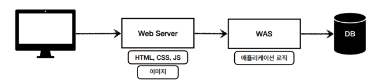

# 웹 애플리케이션의 이해

## **웹 서버, 웹 애플리케이션 서버**

### **웹 서버(Web Server)**

- 웹 브라우저(클라이언트)로부터 HTTP 요청을 받아 정적 컨텐츠를 제공하는 프로그램
- HTTP 기반으로 동작
- 정적 리소스 제공, 기타 부가기능
- 정적(파일) HTML, CSS, JS, 이미지, 영상
- 예) NGINX, APACHE

### **정적 컨텐츠**

- 어느 사용자가 요청하든 항상 동일한 컨텐츠

### **웹 애플리케이션 서버(WAS - Web Application Server)**

- DB 조회나 다양한 로직 처리를 요구하는 동적인 컨텐츠를 제공하기 위해 만들어진 프로그램
- HTTP 기반으로 동작
- 웹 서버 기능 포함+ (정적 리소스 제공 가능)
- 프로그램 코드를 실행해서 애플리케이션 로직 수행
- 동적 HTML, HTTP API(JSON)
- 서블릿, JSP, 스프링 MVC
- 톰캣(Tomcat) Jetty, Undertow

### **동적 컨텐츠**

- 요청 인자에 따라 바뀔 수 있는 컨텐츠

### **웹 서버, 웹 애플리케이션 서버(WAS) 차이**

- 웹 서버는 정적 리소스(파일), WAS는 애플리케이션 로직
- 사실은 둘의 용어도 경계도 모호함
- 웹 서버도 프로그램을 실행하는 기능을 포함하기도 함
- 웹 애플리케이션 서버도 웹 서버의 기능을 제공함
- 자바는 서블릿 컨테이너 기능을 제공하면 WAS
- 서블릿 없이 자바 코드를 실행하는 서버 프레임 워크도 있음
- WAS는 애플리케이션 코드를 실행하는데 더 특화되어 있다고 이해하면 됨

웹 시스템을 WAS와 DB만으로 구성할 수도 있음

하지만 WAS만 쓰게 되면...

- WAS가 너무 많은 역할을 담당, 서버 과부하 우려
- 가장 비싼 애플리케이션 로직이 정적 리소스 때문에 수행이 어려울 수 있음
- WAS 장애 시 오류 화면도 노출 불가능

### **웹 시스템 구성 - WEB, WAS, DB**

- 정적 리소스는 웹 서버가 처리
- 웹 서버는 애플리케이션 로직 같은 동적인 처리가 필요하면 WAS에 요청을 위임
- WAS는 중요한 애플리케이션 로직 처리 전담

- 효율적인 리소스 관리
- 정적 리소스가 많이 사용되면 Web 서버 증설
- 애플리케이션 리소스가 많이 사용되면 WAS 증설
- WAS, DB 장애 시 WEB 서버가 오류 화면 제공 가능

(웹 서버는 잘 죽지 않지만 WAS는 잘 죽음)

웹 브라우저에서 전송한 HTTP 메시지를 서버에서 받은 다음 처리를 해서 응답까지 해줘야 하는데, 별도의 프레임워크를 사용하지 않고, 직접 WAS를 구현해야 한다면 너무 복잡하다

## **서블릿**

서블릿을 지원하는 WAS에서 여러 번거로운 과정을 모두 자동화해서 제공해준다. 그래서 우리는 공통적이고 번거로운 여러 작업을 무시하고 의미 있는 비즈니스 로직 실행에만 집중할 수 있다.

### **특징**
- urlPatterns(/hello)의 URL이 호출되면 서블릿 코드가 실행
- HTTP 요청 정보를 편리하게 사용할 수 있는 `HttpServletRequest`
- HTTP 응답 정보를 편리하게 제공할 수 있는 `HttpServletResponse`
- 개발자는 HTTP 스펙을 매우 편리하게 사용

### **서블릿 HTTP 요청, 응답 흐름**

- HTTP 요청시
- WAS는 Request, Response 객체를 새로 만들어서 서블릿 객체 호출
- 개발자는 Request 객체에서 HTTP 요청 정보를 편리하게 꺼내서 사용
- 개발자는 Response 객체에 HTTP 응답 정보를 편리하게 입력
- WAS는 Response 객체에 담겨있는 내용으로 HTTP 응답 정보를 생성

### **서블릿 컨테이너**

- 톰캣처럼 서블릿을 지원하는 WAS를 서블릿 컨테이너라고 함
- 서블릿 객체(HelloServelt)를 생성, 초기화, 호출, 종료하는 생명주기 관리
- 서블릿 객체는싱글톤으로 관리
- 고객의 요청이 올 때 마다 계속 객체를 생성하는 것은 비효율
- 최초 로딩 시점에 서블릿 객체를 미리 만들어두고 재활용
- 모든 고객 요청은 동일한 서블릿 객체 인스턴스에 접근
- 공유 변수 사용 주의
- 서블릿 컨테이너 종료시 함께 종료
- JSP도 서블릿으로 변환 되어서 사용
- 동시 요청을 위한 멀티 쓰레드 처리 지원

## **동시 요청 - 멀티 쓰레드**

### **쓰레드**

- 애플리케이션 코드를 하나하나 순차적으로 실행하는 것은 쓰레드
- 자바 메인 메서드를 처음 실행하면 main이라는 이름의 쓰레드가 실행
- 쓰레드가 없다면 자바 애플리케이션 실행이 불가능
- 쓰레드는 한번에 하나의 코드 라인만 수행
- 동시 처리가 필요하면 쓰레드를 추가로 생성

### **요청마다 쓰레드 생성 장단점**

- 장점
    - 동시 요청을 처리할 수 있다.
    - 리소스(CPU, 메모리)가 허용할 때 까지 처리가능
    - 하나의 쓰레드가 지연 되어도, 나머지 쓰레드는 정상 동작한다.
- 단점
    - 쓰레드는 생성 비용은 매우 비싸다.
    - 쓰레드는 컨텍스트 스위칭 비용이 발생한다.
    - 쓰레드 생성에 제한이 없다.
    - 요청이 너무 많이 오면, CPU, 메모리 임계점을 넘어서 서버가 죽을 수 있다

### **쓰레드 풀 -** 요청 마다 쓰레드 생성의 단점 보완

- 특징
    - 필요한 쓰레드를 쓰레드 풀에 보관하고 관리한다.
    - 쓰레드 풀에 생성 가능한 쓰레드의 최대치를 관리한다.
    - 톰캣은 최대 200개 기본 설정 (변경 가능)
- 사용
    - 이미 생성되어 있는 쓰레드를 쓰레드 풀에서 꺼내서 사용한다.
    - 사용을 종료하면 쓰레드 풀에 해당 쓰레드를 반납한다.
    - 최대 쓰레드가 모두 사용중이어서 쓰레드 풀에 쓰레드가 없으면?
    - 기다리는 요청은 거절하거나 특정 숫자만큼만 대기하도록 설정 가능
- 장점
    - 쓰레드를 생성하고 종료하는 비용(CPU)이 절약된다.(빠른 응답 시간)
    - 너무 많은 요청이 들어와도 기존 요청은 안전하게 처리할 수 있다.

### **쓰레드 풀 실무 팁**

- WAS의 주요 튜닝 포인트는 최대 쓰레드(max thread) 수이다.
    - 이 값을 너무 낮게 설정하면?
        - 동시 요청이 많으면, 서버 리소스는 여유롭지만, 클라이언트는 금방 응답 지연
    - 이 값을 너무 높게 설정하면?
        - 동시 요청이 많으면, CPU, 메모리 리소스 임계점 초과로 서버 다운
- 장애 발생시?
    - 클라우드면 일단 서버부터 늘리고, 이후에 튜닝
    - 클라우드가 아니면 열심히 튜닝

### **쓰레드 풀의 적정 숫자**

이는 애플리케이션 로직의 복잡도, CPU, 메모리, IO리소스 상황에 따라 모두 다르다. 그래서 한번에 최적화된 쓰레드 풀의 적정숫자를 찾기는 힘들고 성능테스트가 필요하다.

### **WAS의 멀티 쓰레드 지원**

- 멀티 쓰레드에 대한 부분은 WAS가 처리
- 개발자가 멀티 쓰레드 관련 코드를 신경쓰지 않아도 됨
- 멀티 쓰레드 환경이므로 싱글톤 객체(서블릿, 스프링 빈)는 주의해서 사용

## **HTML, HTTP API, CSR, SSR**

### **정적 리소스**

- 서버에 있는 이미지파일, HTML 파일, CSS, JS 파일 등
- 서버에서는 요청에 따라 그냥 해당 리소스들을 응답 메세지에 담아 응답하면 된다.

### **HTML**

- HTML의 경우 필요하다면 동적으로 HTML을 생성해서 반환
- 이때 사용되는게 템플릿엔진(JSP, 타임리프, 벨로시티등)
- WAS에서 동적으로 HTML을 생성해서 응답
- 웹 브라우저에서는 해당 HTML을 해석해서 렌더링

### **HTTP API**

- HTML이 아니라 데이터를 전달하는 것
- 주로 JSON 형식이 사용된다.
- 데이터를 반환할 뿐이기에 다양한 시스템에서 호출이 가능하다.
- 웹, 앱 클라이언트나 서버 간에 통신에서 사용된다는 의미로 데이터만 주고받기에 만약 UI화면이 필요하면, 클라이언트가 별도로 처리해야 한다

### **서버사이드 렌더링, 클라이언트 사이드 렌더링**

- **SSR - 서버 사이드 렌더링**
  - HTML 최종 결과를 서버에서 만들어서 웹 브라우저에 전달
  - 주로 정적인 화면에 사용
  - 관련기술: JSP, 타임리프 -> 백엔드 개발자
- **CSR - 클라이언트 사이드 렌더링**
  - HTML 결과를 자바스크립트를 사용해 웹 브라우저에서 동적으로 생 성해서 적용
  - 주로 동적인 화면에 사용, 웹 환경을 마치 앱 처럼 필요한 부분부분 변경할 수 있음
  - 예) 구글 지도, Gmail, 구글 캘린더
  - 관련기술: React, Vue.js -> 웹 프론트엔드 개발자
