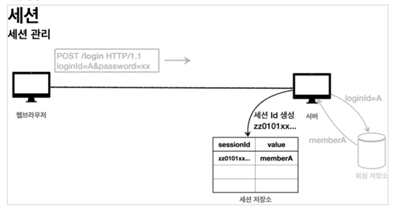
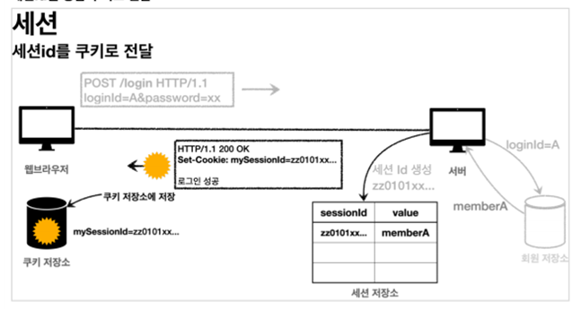

# Login
# **로그인 처리1 - 쿠키, 세션**

## **로그인 처리하기 - 쿠키 사용**

서버에서 로그인에 성공하면 HTTP 응답에 쿠키를 담아서 브라우저에 전달하자. 그러면 브라우저는 앞으로 해당 쿠키를 지속해서 보내준다.

### **쿠키 생성**
### 쿠키에는 영속 쿠키와 세션 쿠키가 있다.

- 영속 쿠키: 만료 날짜를 입력하면 해당 날짜까지 유지
- 세션 쿠키: 만료 날짜를 생략하면 브라우저 종료 시까지만 유지

### **쿠키 생성 로직**

```java
//로그인 성공 처리 
//쿠키에 시간 정보를 주지 않으면 세션 쿠키(브라우저 종료시 모두 종료) 
Cookie idCookie = new Cookie("memberId", String.*valueOf*(loginMember.getId())); 
response.addCookie(idCookie);
```

### 로그인에 성공하면 쿠키를 생성하고 HttpServletResponse에 담는다

```java
@GetMapping("/") 
public String home(@CookieValue(name = "memberId", required = false) Long memberId, 
									Model model) {  
		if (memberId == null) {  
				return "home"; 
		}
		//로그인 상태 
		Member loginMember = memberRepository.findById(memberId); 
		if (loginMember == null) {  
				return "home"; 
		}  
		model.addAttribute("member", loginMember); 
		return "loginHome"; 
}
```

로그인에 성공시 세션 쿠키가 지속해서 유지되고, 웹 브라우저에서 서버에 요청시 memberId 쿠키를 계속 보내준다

### **쿠키 삭제 로직**

```java
private void expireCookie(HttpServletResponse response, String cookieName) {  
                          Cookie cookie = new Cookie(cookieName, null);
	  cookie.setMaxAge(0);  
	  response.addCookie(cookie); 
}
```

- 세션 쿠키이므로 웹 브라우저 종료시
- 서버에서 해당 쿠키의 종료 날짜를 0으로 지정

### **쿠키와 보안 문제**

- 쿠키값은 임의로 변경할 수 있다.
- 클라이언트가 쿠키를 강제로 변경하면 다른 사용자가 된다.
- 실제 웹브라우저 개발자모드 Application Cookie 변경으로 확인
- 쿠키에 보관된 정보는 훔쳐갈 수 있다.
- 만약 쿠키에 개인정보나, 신용카드 정보가 있다면?
- 이 정보가 웹 브라우저에도 보관되고, 네트워크 요청마다 계속 클라 이언트에서 서버로 전달된다.
- 쿠키의 정보가 나의 로컬 PC가 털릴 수도 있고, 네트워크 전송 구 간에서 털릴 수도 있다.
- 해커가 쿠키를 한번 훔쳐가면 평생 사용할 수 있다.

### **대안**

- 쿠키에 중요한 값을 노출하지 않고, 사용자 별로 예측 불가능한 임의의 토큰(랜덤 값)을 노출하고, 서버에서 토큰과 사용자 id를 매핑해서 인식한다. 그리고 서버에서 토큰을 관리한다.
- 토큰은 해커가 임의의 값을 넣어도 찾을 수 없도록 예상 불가능해야 한다.
- 해커가 토큰을 털어가도 시간이 지나면 사용할 수 없도록 서버에서 해당 토큰의 만료시간을 짧게(예: 30분) 유지한다. 또는 해킹이 의심되는 경우 서버에서 해당 토큰을 강제로 제거하면 된다.

## **로그인 처리하기 - 세션 동작 방식**

서버에 중요한 정보를 보관하고 연결을 유지하는 방법을 세션이라 한다

### **세션 동작 방식**

- 세션 ID를 생성하는데, 추정 불가능해야 한다.
- UUID는 추정이 불가능하다.
- 생성된 세션 ID와 세션에 보관할 값( memberA )을 서버의 세션 저장소에 보관한다.
  **세션id를 응답 쿠키로 전달**


클라이언트와 서버는 결국 쿠키로 연결이 되어야 한다.

- 서버는 클라이언트에 mySessionId라는 이름으로 세션ID만 쿠키에 담아서 전달한다.
- 클라이언트는 쿠키 저장소에 mySessionId 쿠키를 보관한다.
- 여기서 중요한 포인트는 회원과 관련된 정보는 전혀 클라이언트에 전달하지 않는다는 것이다. 오직 추정 불가능한 세션 ID만 쿠키를 통해 클라이언트에 전달한다.

### **클라이언트의 세션id 쿠키 전달**

- 클라이언트는 요청시 항상 mySessionId 쿠키를 전달한다.
- 서버에서는 클라이언트가 전달한 mySessionId 쿠키 정보로 세션 저장소를 조회해서 로그인 시 보관한 세션 정보를 사용한다.

### **정리**

세션을 사용해서 서버에서 중요한 정보를 관리하게 되었다. 덕분에 다음과 같은 보안 문제들을 해결할 수 있다.

- 쿠키 값을 변조 가능 -> 예상 불가능한 복잡한 세션Id를 사용한다.
- 쿠키에 보관하는 정보는 클라이언트 해킹시 털릴 가능성이 있다.
    - 세션Id가 털려도 여기에는 중요한 정보가 없다.
- 쿠키 탈취 후 사용 해커가 토큰을 털어가도 시간이 지나면 사용할 수 없도록 서버에서 세션의 만료 시간을 짧게(예: 30분) 유지한다. 또는 해킹이 의심되는 경우 서버에서 해당 세션을 강제로 제거하면 된다.

## **로그인 처리하기 - 서블릿 HTTP 세션**

### **HttpSession 소개**

서블릿을 통해 HttpSession 을 생성하면 다음과 같은 쿠키를 생성한다. 쿠키 이름이 JSESSIONID 이고, 값은 추정 불가능한 랜덤 값이다.

`Cookie: JSESSIONID=5B78E23B513F50164D6FDD8C97B0AD05`

### **HttpSession 사용 – 로그인 후 세션 저장**

```java
//세션이 있으면 있는 세션 반환, 없으면 신규세션 생성 
HttpSession session = request.getSession(); 
//세션에 로그인 회원 정보 보관 
session.setAttribute(SessionConst.*LOGIN_MEMBER*, loginMember);
```

세션을 새로 생성하려면 request.getSession(true) 를 사용하면 된다.

하나의 세션에 여러 값을 저장할 수 있다.

- `request.getSession(true)` (디폴트)
    - 세션이 있으면 기존 세션을 반환한다.
    - 세션이 없으면 새로운 세션을 생성해서 반환한다.
- `request.getSession(false)`
    - 세션이 있으면 기존 세션을 반환한다.
    - 세션이 없으면 새로운 세션을 생성하지 않는다. null을 반환한다.

### **HttpSession 사용 – 로그아웃 후 세션 삭제**

```java
HttpSession session = request.getSession(false);
if (session != null) {
    session.invalidate();
}
```

session.invalidate() : 세션을 제거한다.

### **HttpSession 사용 – 홈 화면에서 세션 유지**

```java
@GetMapping("/") 
public String homeV3(HttpServletRequest request, Model model) {   
		HttpSession session = request.getSession(false);   
		if (session == null) {
		   return "home";  
		}
   
		Member loginMember = (Member) session.getAttribute(SessionConst.*LOGIN_MEMBER*);   

		// 세션에 회원 데이터가 없으면home  
		if (loginMember == null) {
		   return "home";  
		}   
		
		//세션이 유지되면 로그인으로 이동  
		model.addAttribute("member", loginMember);  return "loginHome"; 
}
```

`session.getAttribute(SessionConst.LOGIN_MEMBER)` : 로그인 시점에 세션에 보관한 회원 객체를찾는다.

### **@SessionAttribute**

스프링은 세션을 더 편리하게 사용할 수 있도록 `@SessionAttribute`을 지원한다.

```java
@GetMapping("/") 
public String homeV3Spring (
		@SessionAttribute(name = SessionConst.*LOGIN_MEMBER*, required = false) Member loginMember, 
		Model model) {   

		// 세션에 회원 데이터가 없으면 home  
		if (loginMember == null) {   
				return "home";  
		}   
		
        //세션이 유지되면 로그인으로 이동  
		model.addAttribute("member", loginMember);  
		return "loginHome"; 
}
```

이미 로그인된 사용자를 찾을 때는 다음과 같이 사용하면 된다. 참고로 이 기능은 세션을 생성하지 않는다.

### **TrackingModes**

로그인을 처음 시도하면 URL이 다음과 같이 jsessionid 를 포함하고 있는 것을 확인할 수 있다.

`http://localhost:8080/;jsessionid=F59911518B921DF62D09F0DF8F83F872`

이것은 웹 브라우저가 쿠키를 지원하지 않을 때 쿠키 대신 URL을 통해서 세션을 유지하는 방법이다

URL 전달 방식을 끄고 항상 쿠키를 통해서만 세션을 유지하고 싶으면 application.properties에 다음 옵션을 넣어주면 된다.

**`server.servlet.session.tracking-modes=cookie`**

### **세션 정보와 타임아웃 설정**

**세션 정보 확인**

- sessionId : 세션Id, JSESSIONID의 값이다.
    - 예) 34B14F008AA3527C9F8ED620EFD7A4E1
- maxInactiveInterval : 세션의 유효 시간, 예) 1800초, (30분)
- creationTime : 세션 생성일시
- lastAccessedTime : 세션과 연결된 사용자가 최근에 서버에 접근한 시간, 클라이언트에서 서버로 sessionId ( JSESSIONID )를 요청한 경우에 갱신된다.
- isNew : 새로 생성된 세션인지, 아니면 이미 과거에 만들어졌고, 클라이언트에서 서버로 sessionId ( JSESSIONID )를 요청해서 조회된 세션인지 여부

### **세션 타임아웃 설정**

남아있는 세션을 무한정 보관하면 다음과 같은 문제가 발생할 수 있다.

세션의 종료 시점을 사용자가 서버에 최근에 요청한 시간을 기준으로 30분 정도를 유지. . HttpSession 은 이 방식을 사용한다.

### 스프링 부트로 글로벌 설정

**application.properties**

- `server.servlet.session.timeout=60` : 60초, 기본은 1800(30분)
- (글로벌 설정은 분 단위로 설정해야 한다. 60(1분), 120(2분), ...)

**특정 세션 단위로 시간 설정**

- `session.setMaxInactiveInterval(1800);` //1800초

# **로그인 처리2 - 필터, 인터셉터**

### **공통 관심 사항**

애플리케이션 여러 로직에서 공통으로 관심이 있는 것을 공통 관심사(cross-cutting concern)라고 한다. 여기서는 등록, 수정, 삭제, 조회 등등 여러 로직에서 공통으로 인증에 대해서 관심을 가지고 있다.

### **서블릿 필터 - 소개**

필터는 서블릿이 지원하는 수문장이다. 필터의 특성은 다음과 같다.

### **필터 흐름**

**HTTP 요청 -> WAS -> 필터 -> 서블릿 -> 컨트롤러**

- 필터를 적용하면 필터가 호출 된 다음에 서블릿이 호출된다. 그래서 모든 고객의 요청 로그를 남기는 요구사항이 있다면 필터를 사용하면 된다.
- 필터는 특정 URL 패턴에 적용할 수 있다. `/*` 이라고 하면 모든 요청에 필터가 적용된다.
- 참고로 스프링을 사용하는 경우 여기서 말하는 서블릿은 스프링의 디스패처 서블릿으로 생각하면 된다

### **필터 제한**

- **HTTP 요청 -> WAS -> 필터 -> 서블릿 -> 컨트롤러** //로그인 사용자
- **HTTP 요청 -> WAS -> 필터(적절하지 않은 요청이라 판단, 서블릿 호출X)** //비 로그인 사용자

### **필터 체인**

**HTTP 요청 -> WAS -> 필터1 -> 필터2 -> 필터3 -> 서블릿 -> 컨트롤러**

- 필터는 체인으로 구성되는데, 중간에 필터를 자유롭게 추가할 수 있다

### **필터 인터페이스**

필터 인터페이스를 구현하고 등록하면 서블릿 컨테이너가 필터를 싱글톤 객체로 생성하고, 관리한다.

- `init()`: 필터 초기화 메서드, 서블릿 컨테이너가 생성될 때 호출된다.
- `doFilter()`: 고객의 요청이 올 때마다 해당 메서드가 호출된다. 필터의 로직을 구현하면 된다.
- `destroy()`: 필터 종료 메서드, 서블릿 컨테이너가 종료될 때 호출된다.

### **서블릿 필터 - 요청 로그**

**`public class LogFilter implements Filter`**

- 필터를 사용하려면 필터 인터페이스를 구현해야 한다.

**`doFilter(ServletRequest request, ServletResponse response, FilterChain chain)`**

- HTTP 요청이 오면 doFilter 가 호출된다.
- ServletRequest request 는 HTTP 요청이 아닌 경우까지 고려해서  만든 인터페이스이다. HTTP를 사용하면 **`HttpServletRequest httpRequest = (HttpServletRequest) request;`** 와 같이 다운 케스팅 하면 된다.

**`chain.doFilter(request, response);`**

- 이 부분이 가장 중요하다. 다음 필터가 있으면 필터를 호출하고, 필터가 없으면 서블릿을 호출한다.

만약 이 로직을 호출하지 않으면 다음 단계로 진행되지 않는다.

### **WebConfig - 필터 설정**

필터를 등록하는 방법은 여러가지가 있지만, 스프링 부트를 사용한다면 `FilterRegistrationBean` 을 사용해서 등록하면 된다.

- `setFilter(new LogFilter())` : 등록할 필터를 지정한다.
- `setOrder(1)` : 필터는 체인으로 동작한다. 따라서 순서가 필요하다. 낮을 수록 먼저 동작한다.
- `ddUrlPatterns("/*")`: 필터를 적용할 URL 패턴을 지정한다. 한번에 여러 패턴을 지정할 수 있다.

### **서블릿 필터 - 인증 체크**

```java
private static final String[] whitelist = {"/", "/members/add", "/login",
"/logout","/css/*"};
@Override 
public void doFilter(ServletRequest request, ServletResponse response, FilterChain chain) throws IOException, ServletException {

		HttpServletRequest httpRequest = (HttpServletRequest) request;
		String requestURI = httpRequest.getRequestURI();
		HttpServletResponse httpResponse = (HttpServletResponse) response;
		try {
		if (isLoginCheckPath(requestURI)) {
				HttpSession session = httpRequest.getSession(false);
				if (session == null || session.getAttribute(SessionConst.LOGIN_MEMBER) == null) {
				    //로그인으로 redirect
					httpResponse.sendRedirect("/login?redirectURL=" +requestURI);
					return; //여기가 중요, 미인증 사용자는 다음으로 진행하지 않고 끝!
				}
		}
				chain.doFilter(request, response);
		} catch (Exception e) {
				throw e; //예외 로깅 가능 하지만, 톰캣까지 예외를 보내주어야 함
		}
}
/**
화이트 리스트의 경우 인증 체크X
*/
private boolean isLoginCheckPath(String requestURI) {
		return !PatternMatchUtils.simpleMatch(whitelist, requestURI);
}
```

- `whitelist = {"/", "/members/add", "/login", "/logout","/css/*"};`
- 인증 필터를 적용해도 홈, 회원가입, 로그인 화면, css 같은 리소스에는 접근할 수 있어야 한다.
- `isLoginCheckPath(requestURI)`
    - 화이트 리스트를 제외한 모든 경우에 인증 체크 로직을 적용한다.
- **`httpResponse.sendRedirect("/login?redirectURL=" + requestURI);`**
    - 미인증 사용자는 로그인 화면으로 리다이렉트 한다. 그런데 로그인  이후에 다시 홈으로 이동해버리면, 원하는 경로를 다시 찾아가야 하는  불편함이 있다.
- `return;` 여기가 중요하다. 필터를 더는 진행하지 않는다. 이후 필터는 물론 서블릿, 컨트롤러가 더는 호출되지 않는다. 앞서 redirect를 사용했기 때문에 redirect가 응답으로 적용되고 요청이 끝난다
- 로그인 체크 필터에서, 미인증 사용자는 요청 경로를 포함해서 `/login` 에 redirectURL 요청 파라미터를 추가해서 요청했다. 이 값을 사용해서 로그인 성공시 해당 경로로 고객을 redirect 한다

**(로그인 컨틀롤러의 리턴값)**

`return "redirect:" + redirectURL;`

### **스프링 인터셉터 - 소개**

스프링 인터셉터도 서블릿 필터와 같이 웹과 관련된 공통 관심 사항을 효과적으로 해결할 수 있는 기술이다.

서블릿 필터가 서블릿이 제공하는 기술이라면, 스프링 인터셉터는 스프링 MVC가 제공하는 기술이다. 둘 다 웹과 관련된 공통 관심 사항을 처리하지만, 적용되는 순서와 범위, 그리고 사용 방법이 다르다.

### **스프링 인터셉터 흐름**

**HTTP 요청 -> WAS -> 필터 -> 서블릿 -> 스프링 인터셉터 -> 컨트롤러**

- 스프링 인터셉터는 디스패처 서블릿과 컨트롤러 사이에서 컨트롤러 호출 직전에 호출된다.
- 스프링 인터셉터는 스프링 MVC가 제공하는 기능이기 때문에 결국 디스패처 서블릿 이후에 등장하게 된다.
- 스프링 MVC의 시작점이 디스패처 서블릿이라고 생각해보면 이해가 될 것이다.
- 스프링 인터셉터에도 URL 패턴을 적용할 수 있는데, 서블릿 URL 패턴과는 다르고, 매우 정밀하게 설정할 수 있다.

### **스프링 인터셉터 제한**

**HTTP 요청 -> WAS -> 필터 -> 서블릿 -> 스프링 인터셉터 -> 컨트롤러 //로그인 사용자**

**HTTP 요청 -> WAS -> 필터 -> 서블릿 -> 스프링 인터셉터(적절하지 않은 요청이라 판단, 컨트롤러 호출 X) // 비 로그인 사용자**

### **스프링 인터셉터 체인**

**HTTP 요청 -> WAS -> 필터 -> 서블릿 -> 인터셉터1 -> 인터셉터2 -> 컨트롤러**

### **스프링 인터셉터 인터페이스**

스프링의 인터셉터를 사용하려면 `HandlerInterceptor` 인터페이스를 구현하면 된다.

- 서블릿 필터의 경우 단순하게 `doFilter()` 하나만 제공된다. 인터셉터는 컨트롤러 호출 전 (`preHandle`), 호출 후 (`postHandl`), 요청 완료 이후 (`afterCompletion`)와 같이 단계적으로 잘 세분화 되어 있다.
- 서블릿 필터의 경우 단순히 `request` , `response`만 제공했지만, 인터셉터는 어떤 컨트롤러( `handler`)가 호출되는지 호출 정보도 받을 수 있다. 그리고 어떤 `modelAndView`가 반환되는지 응답 정보도 받을 수 있다

### **스프링 인터셉터 호출 흐름**
**정상 흐름**

- `preHandle`: 컨트롤러 호출 전에 호출된다. (더 정확히는 핸들러 어댑터 호출 전에 호출된다.)
    - `preHandle`의 응답값이 true이면 다음으로 진행하고, false이면  더는 진행하지 않는다. false인 경우 나머지 인터셉터는 물론이고, 핸들러 어댑터도 호출되지 않는다. 그림에서 1번에서 끝이 나버린다.
- `postHandle`: 컨트롤러 호출 후에 호출된다. (더 정확히는 핸들러 어댑터 호출 후에 호출된다.)
- `afterCompletion`: 뷰가 렌더링 된 이후에 호출된다.

### **스프링 인터셉터 예외 상황**

**예외가 발생시**

- `preHandle`: 컨트롤러 호출 전에 호출된다.
- `postHandle` : 컨트롤러에서 예외가 발생하면 `postHandle`은 호출되지 않는다.
- `afterCompletion` : `afterCompletion`은 항상 호출된다. 이 경우 예외 (ex)를 파라미터로 받아서 어떤 예외가 발생했는지 로그로 출력할 수 있다.

**afterCompletion은 예외가 발생해도 호출된다.**

- 예외가 발생하면 `postHandle()` 는 호출되지 않으므로 예외와 무관하게 공통 처리를 하려면 `afterCompletion()` 을 사용해야 한다.
- 예외가 발생하면 `afterCompletion()` 에 예외 정보(ex)를 포함해서 호출된다.

**스프링 MVC를 사용하고, 특별히 필터를 꼭 사용해야 하는 상황이 아니라면 인터셉터를 사용하는 것이 더 편리하다**

```java
public class LoginInterceptor implements HandlerInterceptor {

		@Override 
		public boolean preHandle(HttpServletRequest request, HttpServletResponse response, Object handler) throws Exception {   }
		@Override 
		public void postHandle(HttpServletRequest request, HttpServletResponse response, Object handler, ModelAndView modelAndView) throws Exception {  } 
		@Override 
		public void afterCompletion(HttpServletRequest request, HttpServletResponse response, Object handler, Exception ex) throws Exception { } 
}
```

### **HandlerMethod**

```java
if (handler instanceof HandlerMethod) { 
		//호출할 컨트롤러 메서드의 모든 정보가 포함되어 있다  
		HandlerMethod hm = (HandlerMethod) handler; 
}
```

핸들러 정보는 어떤 핸들러 매핑을 사용하는가에 따라 달라진다. 스프링을 사용하면 일반적으로 `@Controller`, `@RequestMapping` 을 활용한 핸들러 매핑을 사용하는데, 이 경우 핸들러 정보로 `HandlerMethod`가 넘어온다.

### **ResourceHttpRequestHandler**

`@Controller`가 아니라 `/resources/static`와 같은 정적 리소스가 호출 되는 경우 `ResourceHttpRequestHandler`가 핸들러 정보로 넘어오기 때문에 타입에 따라서 처리가 필요하다.

### **postHandle, afterCompletion**

종료 로그를 `postHandle`이 아니라 `afterCompletion`에서 실행한 이유는, 예외가 발생한 경우 `postHandle`가 호출되지 않기 때문이다. `afterCompletion`은 예외가 발생해도 호출 되는 것을 보장한다.

### **WebConfig - 인터셉터 등록**

```java
@Configuration 
public class WebConfig implements WebMvcConfigurer {  
		@Override 
		public void addInterceptors(InterceptorRegistry registry) {
		    registry.addInterceptor(new LoginInterceptor())
                        .order(1)
                        .addPathPatterns("/**")
                        .excludePathPatterns("/css/**", "/*.ico", "/error");
        }
}
```

`WebMvcConfigurer`가 제공하는 `addInterceptors()`를 사용해서 인터셉터를 등록할 수 있다.

- `registry.addInterceptor(new LogInterceptor())` : 인터셉터를 등록한다.
- `order(1`) : 인터셉터의 호출 순서를 지정한다. 낮을수록 먼저 호출된다.
- `addPathPatterns("/**")`: 인터셉터를 적용할 URL 패턴을 지정한다.
- `excludePathPatterns("/css/**", "/*.ico", "/error")` : 인터셉터에서 제외할 패턴을 지정한다

### **스프링 인터셉터 - 인증 체크**

```java
public class LoginCheckInterceptor implements HandlerInterceptor {  
		@Override 
		public boolean preHandle(HttpServletRequest request, HttpServletResponse response, Object handler) throws Exception {   
				String requestURI = request.getRequestURI();

				HttpSession session = request.getSession();   

				if (session == null || session.getAttribute(SessionConst.*LOGIN_MEMBER*) == null) { 
						//로그인으로redirect   
						response.sendRedirect("/login?redirectURL=" + requestURI);   
						return false;   
				}  
				return true; 
		} 
}
```

인증이라는 것은 컨트롤러 호출 전에만 호출되면 된다.

따라서 `preHandle`만 구현하면 된다.

### **인터셉터 등록 - 순서 주의, 세밀한 설정 가능**

```java
@Override 
public void addInterceptors(InterceptorRegistry registry) {  
		registry.addInterceptor(new LoginInterceptor()) 
						.order(1)   
						.addPathPatterns("/**")   
						.excludePathPatterns("/css/**", "/*.ico", "/error");  
 
		registry.addInterceptor(new LoginCheckInterceptor())   
						.order(2)   
						.addPathPatterns("/**")   
						.excludePathPatterns("/", "/members/add", "/login", "/logout", "/css/**", "/*.ico", "/error"); 
}
```

### **ArgumentResolver 활용**

```java
@GetMapping("/") 
public String homeV3ArgumentResolver(@Login Member loginMember, Model model) {   
		// 세션에 회원 데이터가 없으면home  
		if (loginMember == null) {   
				return "home";  
		}   

		//세션이 유지되면 로그인으로 이동  
		model.addAttribute("member", loginMember);  
		return "loginHome"; 
}
```

`@Login` 애노테이션이 있으면 직접 만든 `ArgumentResolver`가 동작해서 자동으로 세션에 있는 로그인 회원을 찾아주고, 만약 세션에 없다면 `null`을 반환

### **@Login 애노테이션 생성**

```java
@Target(ElementType.*PARAMETER*) 
@Retention(RetentionPolicy.*RUNTIME*) 
public @interface Login { }
```

- `@Target(ElementType.PARAMETER)` : 파라미터에만 사용
- `@Retention(RetentionPolicy.RUNTIME)` : 리플렉션 등을 활용할 수 있도록 런타임까지 애노테이션 정보가 남아있음

### **LoginMemberArgumentResolver 생성**

```java
@Slf4j 
public class LoginMemberArgumentResolver implements HandlerMethodArgumentResolver {  

@Override 
public boolean supportsParameter(MethodParameter parameter) {  
		return parameter.hasParameterAnnotation(Login.class) 
                    && Member.class.isAssignableFrom(parameter.getParameterType()); 
}  

@Override 
public Object resolveArgument(MethodParameter parameter, ModelAndViewContainer mavContainer, 
    NativeWebRequest webRequest, WebDataBinderFactory binderFactory) throws Exception {   
 
		HttpServletRequest request = (HttpServletRequest) webRequest.getNativeRequest(); 
		HttpSession session = request.getSession(false);   
		if (session == null) {   
				return null;  
		}  
		return session.getAttribute(SessionConst.*LOGIN_MEMBER*); 
}
```

- `supportsParameter()` : `@Login` 애노테이션이 있으면서 `Member`타입이면 해당 ArgumentResolver가 사용된다.
- `resolveArgument()` : 컨트롤러 호출 직전에 호출 되어서 필요한 파라미터 정보를 생성해준다. 여기서는 세션에 있는 로그인 회원 정보인 `member` 객체를 찾아서 반환해준다. 이후 스프링MVC는 컨트롤러의 메서드를 호출하면서 여기에서 반환된 `member`객체를 파라미터에 전달해준다.

### **WebMvcConfigurer에 설정 추가**

```java
@Configuration 
public class WebConfig implements WebMvcConfigurer {  
 
		@Override 
		public void addArgumentResolvers(List<HandlerMethodArgumentResolver> resolvers) {  
				resolvers.add(new LoginMemberArgumentResolver()); 
		}
```
