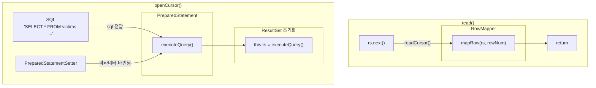

# 관계형 데이터베이스 읽고 쓰기

## Spring Batch의 두 가지 전략

- 커서 기반 처리 (`JdbcCursorItemReader`)
    - DB와 연결을 유지하며 데이터를 순차 조회
    - 하나의 커넥션으로 데이터를 스트리밍 처리
    - 메모리는 최소한으로 사용하며 최대한의 성능
- 페이징 기반 처리 (`JdbcPagingItemReader`)
    - 데이터를 일정한 크기로 잘라 차근차근 처리
    - 각 페이지마다 새로운 쿼리를 날려 안정성 보장

## JdbcCursorItemReader

- DB와 연결을 끊지 않고 `ResultSet`으로 데이터를 순차적으로 가져오는 방식
    - `JdbcCursorItemReader`가 초기화되며 SQL을 실행
    - 이후 `read()`가 호출될 때마다 `ResultSet.next()`를 호출
- 핵심은 데이터베이스와 연결을 유지한 채 진행한다는 것
    - 메모리 사용량을 최소화할 수 있다.
    - 다만 긴 배치 작업 동안 커넥션이 너무 오래 유지된다는 단점이 존재

### JdbcCursorItemReader 해부

```
JdbcCursorItemReader
    │
    ├────── DataSource  
    │        └─ (DB 연결 관리)  
    │
    ├────── SQL  
    │        └─ (데이터 조회 쿼리)  
    │
    ├────── RowMapper  
    │        └─ (ResultSet → Java 객체 변환)  
    │
    ├────── PreparedStatement  
    │        └─ (쿼리 실행 및 결과 조회)  
    │
    └────── PreparedStatementSetter (optional)  
             └─ (파라미터 동적 바인딩) 
```

- `DataSource`
    - DB와의 연결 담당
    - HikariCP(커넥션 풀) 기반
- sql - 쿼리
    - 데이터 조회를 위해 사용할 SQL 쿼리
- `rowMapper`
    - DB에서 가져온 원시 데이터(`ResultSet`)을 객체로 변환
    - 파일 처리에서 다뤘던 `FiledSet`과 유사
    - Spring Batch의 `RowMapper`
        - `BeanPropertyRowMapper` - 전통적인 자바빈 규약 `setter` 기반 매핑
        - `DataClassRowMapper` - Java `Record`나 Kotlin `Data Class` 같은 불변 객체를 위한 구현체로 생성자 파라미터 기반 매핑을 수행
        - Custom `RowMapper` - 별도의 복잡한 변환 로직 필요 시 직접 구현
- `PreparedStatement`
    - 내부적으로 쿼리를 실행하고 결과를 `ResultSet`으로 가져오는 JDBC의 핵심 컴포넌트
- `PreparedStatementSetter` (선택 사항)
    - `PreparedStatement`에 동적으로 파라미터 값을 주입하는 역할을 수행
    - ex) ‘오늘 가입한 고객만’, ‘ACTVIE 상태만’


