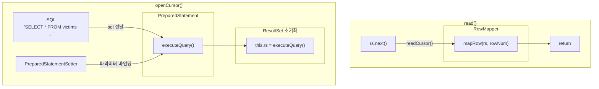

# 관계형 데이터베이스 읽고 쓰기

## Spring Batch의 두 가지 전략

- 커서 기반 처리 (`JdbcCursorItemReader`)
    - DB와 연결을 유지하며 데이터를 순차 조회
    - 하나의 커넥션으로 데이터를 스트리밍 처리
    - 메모리는 최소한으로 사용하며 최대한의 성능
- 페이징 기반 처리 (`JdbcPagingItemReader`)
    - 데이터를 일정한 크기로 잘라 차근차근 처리
    - 각 페이지마다 새로운 쿼리를 날려 안정성 보장

## JdbcCursorItemReader

- DB와 연결을 끊지 않고 `ResultSet`으로 데이터를 순차적으로 가져오는 방식
    - `JdbcCursorItemReader`가 초기화되며 SQL을 실행
    - 이후 `read()`가 호출될 때마다 `ResultSet.next()`를 호출
- 핵심은 데이터베이스와 연결을 유지한 채 진행한다는 것
    - 메모리 사용량을 최소화할 수 있다.
    - 다만 긴 배치 작업 동안 커넥션이 너무 오래 유지된다는 단점이 존재

### JdbcCursorItemReader 해부

```
JdbcCursorItemReader
    │
    ├────── DataSource  
    │        └─ (DB 연결 관리)  
    │
    ├────── SQL  
    │        └─ (데이터 조회 쿼리)  
    │
    ├────── RowMapper  
    │        └─ (ResultSet → Java 객체 변환)  
    │
    ├────── PreparedStatement  
    │        └─ (쿼리 실행 및 결과 조회)  
    │
    └────── PreparedStatementSetter (optional)  
             └─ (파라미터 동적 바인딩) 
```

- `DataSource`
    - DB와의 연결 담당
    - HikariCP(커넥션 풀) 기반
- sql - 쿼리
    - 데이터 조회를 위해 사용할 SQL 쿼리
- `rowMapper`
    - DB에서 가져온 원시 데이터(`ResultSet`)을 객체로 변환
    - 파일 처리에서 다뤘던 `FiledSet`과 유사
    - Spring Batch의 `RowMapper`
        - `BeanPropertyRowMapper` - 전통적인 자바빈 규약 `setter` 기반 매핑
        - `DataClassRowMapper` - Java `Record`나 Kotlin `Data Class` 같은 불변 객체를 위한 구현체로 생성자 파라미터 기반 매핑을 수행
        - Custom `RowMapper` - 별도의 복잡한 변환 로직 필요 시 직접 구현
- `PreparedStatement`
    - 내부적으로 쿼리를 실행하고 결과를 `ResultSet`으로 가져오는 JDBC의 핵심 컴포넌트
- `PreparedStatementSetter` (선택 사항)
    - `PreparedStatement`에 동적으로 파라미터 값을 주입하는 역할을 수행
    - ex) ‘오늘 가입한 고객만’, ‘ACTVIE 상태만’



### JdbcCursorItemReader 구성하기

```kotlin
@Bean
fun terminatedVictimReader(): JdbcCursorItemReader<Victim> =
    JdbcCursorItemReaderBuilder<Victim>()
        .name("terminatedVictimReader")
        .dataSource(dataSource)
        .sql("SELECT * FROM victims WHERE status = ? AND terminated_at <= ?")
        .queryArguments(listOf("TERMINATED", LocalDateTime.now()))
        .dataRowMapper(Victim::class.java)
        .build()
```

- `.dataSource()`- 빈 주입 받은 `DataSource`를 주입
- `.sql()`- 쿼리를 전달
  - 파라미터는 `?`로 마스킹
- `.queryArguments()`
  - `sql()` 메서드에 지정한 쿼리의 바인딩 파라미터값을 전달
  - `ArgumentPreparedStatementSetter`가 사용됨
- `.dataRowMapper()`
  - `RowMapper`는 `ResultSet`을 객체로 변환하는 역할을 수행
  - 위 코드는 코틀린 data class를 사용했기에 .`dataRowMapper`를 사용
  - 자바빈 규약의 `setter` 기반 객체 매핑에는 `.beanRowMapper()`를 사용하면 된다.

### JDBC 드라이버의 내부 최적화

- `ResultSet` 내부 버퍼링
  - JDBC 드라이버는 여러 row를 미리 가져와 `ResultSet` 내부 버퍼에 저장해 둔다.
  - `IteamReader.read()` → `ResultSet.next()` → 버퍼에서 데이터 확인 후 반환 또는 네트워크 통신 후 반환

> MySQL 드라이버는 `useCursorFetch` connection property 설정이 없으면 기본적으로 모든 쿼리 결과를 메모리에 가져온다. 대량 데이터를 다루려면 `userCursorFetch=true`를 설정해야 분할 로딩이 가능하다.
>

- Fetch Size 네트워크 비용 최적화
  - `fetchSize` - JDBC 드라이버가 한 번에 가져올 row 개수를 지정
  - 다만 이 값은 JDBC 드라이버에게 주는 힌트일 뿐이다.
    - 실제 건수는 드라이버 구현체와 DB 정책에 따라 달라질 수 있다.
  - `JdbcCursorItemReaderBuilder.fetchSize`로 설정 가능

### 커서 연속성

- `JdbcCursorItemReader`는 기본적으로 `Step` 트랜잭션과 별도의 데이터베이스 커넥션을 사용한다.
  - 때문에 청크 지향 처리에서 청크 트랜잭션이 닫혀도 커서는 유지된다.

### 스냅샷 읽기

- `JdbcCursorItemReader`가 조회하는 데이터가 중간에 변경되어도 reader는 그 변화를 보지 못한다.
- ex) status = ‘RUNNING’인 row 100개를 커서가 조회하기 시작하고 중간에 해당 row 상태가 다르게 변경된다해도 `JdbcCursorItemReader`는 100개 그대로 읽어버린다.

### JdbcCursorItemReader의 ORDER BY 설정

- `JdbcCursorItemReader`에서 `ORDER BY`는 필수다.
- `Step`이 실패 시 `JdbcCursorItemReader`는 재시도를 위해 `jumpToItem`() 메서드를 통해 실패 지점을 찾는다.
  - `ResultSet.next`를 호출하여 실패 지점까지 커서를 이동시킨다.
  - 이 때 쿼리 결과 순서가 매번 다르다면 이동한 지점이 이전 실행 지점이라고 보장할 수 없다.
- 즉 재시작 시 동일 데이터 순서를 보장하기 위해 `ORDER BY`가 필요한 것
  - `ORDER BY` 절에는 유니크한 값(보통 PK)을 포함하도록 해야 한다.
