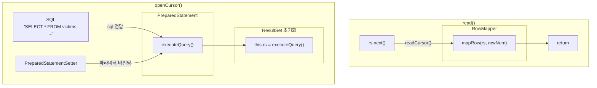

# 관계형 데이터베이스 읽고 쓰기

## Spring Batch의 두 가지 전략

- 커서 기반 처리 (`JdbcCursorItemReader`)
    - DB와 연결을 유지하며 데이터를 순차 조회
    - 하나의 커넥션으로 데이터를 스트리밍 처리
    - 메모리는 최소한으로 사용하며 최대한의 성능
- 페이징 기반 처리 (`JdbcPagingItemReader`)
    - 데이터를 일정한 크기로 잘라 차근차근 처리
    - 각 페이지마다 새로운 쿼리를 날려 안정성 보장

## JdbcCursorItemReader

- DB와 연결을 끊지 않고 `ResultSet`으로 데이터를 순차적으로 가져오는 방식
    - `JdbcCursorItemReader`가 초기화되며 SQL을 실행
    - 이후 `read()`가 호출될 때마다 `ResultSet.next()`를 호출
- 핵심은 데이터베이스와 연결을 유지한 채 진행한다는 것
    - 메모리 사용량을 최소화할 수 있다.
    - 다만 긴 배치 작업 동안 커넥션이 너무 오래 유지된다는 단점이 존재

### JdbcCursorItemReader 해부

```
JdbcCursorItemReader
    │
    ├────── DataSource  
    │        └─ (DB 연결 관리)  
    │
    ├────── SQL  
    │        └─ (데이터 조회 쿼리)  
    │
    ├────── RowMapper  
    │        └─ (ResultSet → Java 객체 변환)  
    │
    ├────── PreparedStatement  
    │        └─ (쿼리 실행 및 결과 조회)  
    │
    └────── PreparedStatementSetter (optional)  
             └─ (파라미터 동적 바인딩) 
```

- `DataSource`
    - DB와의 연결 담당
    - HikariCP(커넥션 풀) 기반
- sql - 쿼리
    - 데이터 조회를 위해 사용할 SQL 쿼리
- `rowMapper`
    - DB에서 가져온 원시 데이터(`ResultSet`)을 객체로 변환
    - 파일 처리에서 다뤘던 `FiledSet`과 유사
    - Spring Batch의 `RowMapper`
        - `BeanPropertyRowMapper` - 전통적인 자바빈 규약 `setter` 기반 매핑
        - `DataClassRowMapper` - Java `Record`나 Kotlin `Data Class` 같은 불변 객체를 위한 구현체로 생성자 파라미터 기반 매핑을 수행
        - Custom `RowMapper` - 별도의 복잡한 변환 로직 필요 시 직접 구현
- `PreparedStatement`
    - 내부적으로 쿼리를 실행하고 결과를 `ResultSet`으로 가져오는 JDBC의 핵심 컴포넌트
- `PreparedStatementSetter` (선택 사항)
    - `PreparedStatement`에 동적으로 파라미터 값을 주입하는 역할을 수행
    - ex) ‘오늘 가입한 고객만’, ‘ACTVIE 상태만’



### JdbcCursorItemReader 구성하기

```kotlin
@Bean
fun terminatedVictimReader(): JdbcCursorItemReader<Victim> =
    JdbcCursorItemReaderBuilder<Victim>()
        .name("terminatedVictimReader")
        .dataSource(dataSource)
        .sql("SELECT * FROM victims WHERE status = ? AND terminated_at <= ?")
        .queryArguments(listOf("TERMINATED", LocalDateTime.now()))
        .dataRowMapper(Victim::class.java)
        .build()
```

- `.dataSource()`- 빈 주입 받은 `DataSource`를 주입
- `.sql()`- 쿼리를 전달
  - 파라미터는 `?`로 마스킹
- `.queryArguments()`
  - `sql()` 메서드에 지정한 쿼리의 바인딩 파라미터값을 전달
  - `ArgumentPreparedStatementSetter`가 사용됨
- `.dataRowMapper()`
  - `RowMapper`는 `ResultSet`을 객체로 변환하는 역할을 수행
  - 위 코드는 코틀린 data class를 사용했기에 .`dataRowMapper`를 사용
  - 자바빈 규약의 `setter` 기반 객체 매핑에는 `.beanRowMapper()`를 사용하면 된다.

### JDBC 드라이버의 내부 최적화

- `ResultSet` 내부 버퍼링
  - JDBC 드라이버는 여러 row를 미리 가져와 `ResultSet` 내부 버퍼에 저장해 둔다.
  - `IteamReader.read()` → `ResultSet.next()` → 버퍼에서 데이터 확인 후 반환 또는 네트워크 통신 후 반환

> MySQL 드라이버는 `useCursorFetch` connection property 설정이 없으면 기본적으로 모든 쿼리 결과를 메모리에 가져온다. 대량 데이터를 다루려면 `userCursorFetch=true`를 설정해야 분할 로딩이 가능하다.
>

- Fetch Size 네트워크 비용 최적화
  - `fetchSize` - JDBC 드라이버가 한 번에 가져올 row 개수를 지정
  - 다만 이 값은 JDBC 드라이버에게 주는 힌트일 뿐이다.
    - 실제 건수는 드라이버 구현체와 DB 정책에 따라 달라질 수 있다.
  - `JdbcCursorItemReaderBuilder.fetchSize`로 설정 가능

### 커서 연속성

- `JdbcCursorItemReader`는 기본적으로 `Step` 트랜잭션과 별도의 데이터베이스 커넥션을 사용한다.
  - 때문에 청크 지향 처리에서 청크 트랜잭션이 닫혀도 커서는 유지된다.

### 스냅샷 읽기

- `JdbcCursorItemReader`가 조회하는 데이터가 중간에 변경되어도 reader는 그 변화를 보지 못한다.
- ex) status = ‘RUNNING’인 row 100개를 커서가 조회하기 시작하고 중간에 해당 row 상태가 다르게 변경된다해도 `JdbcCursorItemReader`는 100개 그대로 읽어버린다.

### JdbcCursorItemReader의 ORDER BY 설정

- `JdbcCursorItemReader`에서 `ORDER BY`는 필수다.
- `Step`이 실패 시 `JdbcCursorItemReader`는 재시도를 위해 `jumpToItem`() 메서드를 통해 실패 지점을 찾는다.
  - `ResultSet.next`를 호출하여 실패 지점까지 커서를 이동시킨다.
  - 이 때 쿼리 결과 순서가 매번 다르다면 이동한 지점이 이전 실행 지점이라고 보장할 수 없다.
- 즉 재시작 시 동일 데이터 순서를 보장하기 위해 `ORDER BY`가 필요한 것
  - `ORDER BY` 절에는 유니크한 값(보통 PK)을 포함하도록 해야 한다.

## **JdbcPagingItemReader**

- 페이지 단위로 데이터를 처리하는 `ItemReader` 구현체
- `JdbcPagingItemReader`**는** `Keyset`  기반 페이징을 수행한다.
  - offset 기반 페이징 - `SELECT * FROM victims ORDER BY id LIMIT 10 OFFSET 20`
    - `OFFSET + LIMIT`만큼의 데이터를 먼저 스캔한 뒤, 앞의`OFFSET`만큼을 버리는 방식
  - keyset 기반 페이징 - `SELECT * FROM victims WHERE id > 1000 ORDER BY id LIMIT 10`
    - 각 페이지 요청마다 이전 결과의 마지막 `id`값을 기준으로 다음 데이터를 조회

### **JdbcPagingItemReader 해부**

```
JdbcPagingItemReader
    |
    - DataSource   
    |        └── (데이터베이스 연결)
    |
    - RowMapper
    |        └── (ResultSet → Java 객체 변환) 
    |
    - NamedParameterJdbcTemplate
    |        └── (SQL 실행 및 파라미터 바인딩)
    |
    - PagingQueryProvider
					   ├── (쿼리 생성 및 페이징 전략)
             └── (DB별 SQL 최적화)
```

- `DataSource`, `RowMapper`는 `JdbcCursorItemReader`와 비슷한 역할을 수행한다.
- `NamedParameterJdbcTemplate`
  - `JdbcTemplate`에서 한 단계 발전한 이름 기반 파라미터 매핑을 사용
    - ex) `WHERE status = :status`
  - `?`와 위치 기반 매칭을 하지 않아도 된다.
- `PagingQueryProvider` - 페이징 쿼리 생성
  - Keyset 기반 페이징을 위한 쿼리 생성 도구
  - Spring Batch는 각 DB에 맞는 최적화된 구현체를 제공한다.
    - `PostgresPagingQueryProvider`**,** `MySqlPagingQueryProvider`
  - 직접 지정할 수도 있지만 내부적으로 DB 타입에 맞는 적절한 provider가 구성된다.

### **JdbcPagingItemReader 구성하기**

- 아래는 `JdbcPagingItemReaderBuilder`**로**  `JdbcPagingItemReader`를 구성하는  코드다.

```kotlin
@Bean
fun terminatedVictimReader(): JdbcPagingItemReader<Victim> =
    JdbcPagingItemReaderBuilder<Victim>()
        .name("terminatedVictimReader")
        .dataSource(dataSource)
        .pageSize(5)
        .selectClause("SELECT id, name, process_id, terminated_at, status")
        .fromClause("FROM victims")
        .whereClause("WHERE status = :status AND terminated_at <= :terminatedAt")
        .sortKeys(mapOf("id" to Order.ASCENDING))
        .parameterValues(
            mapOf(
                "status" to "TERMINATED",
                "terminatedAt" to LocalDateTime.now(),
            ),
        ).dataRowMapper(Victim::class.java)
        .build()
```

- `pageSize()` - 페이지 크기 지정
  - 동작을 명확히 하려면 `chunkSize`와 동일한 값으로 하는 것을 권장한다.
  - `chunk` 크기와 `pageSize`가 같으면 한 번의 청크 처리마다 한 번의 조회 쿼리가 호출된다.
- `selectClause()`, `fromClause()`, `whereClause()`, `sortKeys()`
  - sql의 각 구문을 담당하며 db 구현체에 따라 알맞은 `PagingQueryProvider` 구현체가 지정된다.
  - 만약 `queryProvider`를 직접 따로 지정하면 위 설정들은 무시되기에 하나만 사용해야 한다.
  - keyset 페이지네이션을 사용하는 `JdbcPagingItemReader`이기에 정렬 키 지정이 필수다.

## JdbcBatchItemWriter

- `JdbcBatchItemWriter`는 Spring Batch에서 제공하는 가장 기본적인  쓰기 도구
  - 내부적으로 `NamedParameterJdbcTemplate` **사용**
  - `JdbcTemplate`의 `batchUpdate` 사용

### 일반 INSERT vs Multi-value INSERT vs Batch Update

- 일반 INSERT - 매 쿼리마다 네트워크 패킷 발생
- Multi-value INSERT - 여러 값을 하나의 쿼리로 한 번에 전송
  - `INSERT INTO victims (id, name) VALUES (1, '김배치'), (2, '사불링');`
- Batch Update
  - `PreparedStatement`를 재사용하여 쿼리 템플릿 하나와 여러 파라미터 세트를 함께 전송
  - 배치 쿼리는 DB 서버 내에서 파싱되어 모두 하나의 트랜잭션에서 수행된다.

```sql
-- 패킷1
INSERT INTO victims (id, name) VALUES (?, ?)
-- 첫번째 레코드
ps.setLong(1, 1);
ps.setString(2, "김배치");
ps.addBatch();

-- 두번째 레코드
ps.setLong(1, 2);
ps.setString(2, "사불링");
ps.addBatch();
```

- 만약 insert 작업을 할 경우엔 Multi-value INSERT를 권장한다.
  - batchUpdate는 DB 서버에서 각 쿼리가 개별 실행
  - Multi-value INSERT는 하나의 통합된 쿼리로 실행
- MySQL과 PostgreSQL에선 아래 설정을 통해 batchUpdate를 Multi-value INSERT로 자동 변환 가능

```yaml
## application.yml

# MYSQL
url: jdbc:mysql://localhost:3306/mysql?rewriteBatchedStatements=true 
#POSTGRESQL
url: jdbc:postgresql://localhost:5432/postgres?reWriteBatchedInserts=true 
```

### JdbcBatchItemWriter 해부

```
JdbcBatchItemWriter
    │
    ├────── NamedParameterJdbcTemplate  
    │        └─ (쿼리 실행)  
    │
    ├────── SQL  
    │        └─ (데이터 삽입/수정을 위한 쿼리)  
    │
    ├──────  ItemSqlParameterSourceProvider or ItemPreparedStatementSetter
             └─ (Java 객체 → SQL 파라미터 매핑)
```

- `NamedParameterJdbcTemplate`
  - 이름 기반 파라미터 바인딩을 지원하는 `JdbcTemplate`
- SQL
  - 데이터 처리를 위한 명령어
- `ItemSqlParameterSourceProvider`
  - 객체 프로퍼티를 SQL 네임드 파라미터에 매핑하는 담당
  - `JdbcBatchItemWriterBuilder.beaMapped()`를 사용하면 `BeanPropertyItemSqlParameterSourceProvider` 구현체가 사용된다. (자바빈)
  - 빌더의 `itemSqlParameterSourceProvider`() 메서드를 통해 커스텀 구현체를 지정할 수도 있다.
- ItemPreparedStatementSetter
  - 객체 데이터를 `PreparedStatement` 파라미터에 설정하는 담당

```java
public interface ItemPreparedStatementSetter<T> {
		void setValues(T item, PreparedStatement ps) throws SQLException;
}
```

- 동작 과정 개요
  - 청크로 모아진 아이템들이 `JdbcBatchItemWriter`에 전달된다.
  - `NamedParameterJdbcTemplate`이 각 도구를 사용하여 `PreparedStatement`에 파라미터를 설정, 설정된 `PreparedStatement`는 배치에 차례대로 추가된다.
  - 마지막 아이템까지 처리되면 모든 `PreparedStatement`가 단일 네트워크 호출로 DB에 전송된다.
