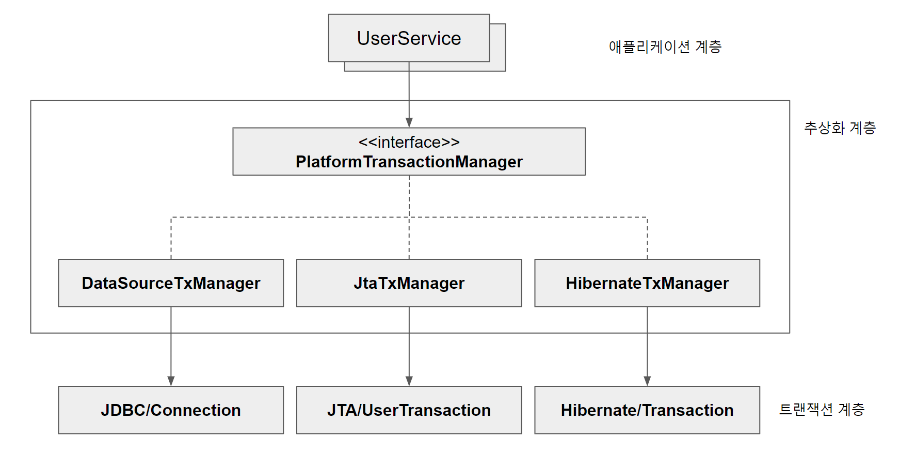

# 서비스 추상화
## 트랜잭션 서비스 추상화

### 기술과 환경에 종속되는 트랜잭션 경계 설정 코드

하나의 트랜잭션 안에서 여러 개의 DB 데이터를 업데이트 해야 할 필요가 생겼다. 한 개 이상의 DB로의 작업을 하나의 트랜잭션으로 만드는 건 JDBC의 Connection을 이용한 트랜잭션 방식인 로컬 트랜잭션으로는 불가능하다. 글로벌 트랜잭션 방식을 사용해야 하는데 JTA(Java TransactionApi)에서 제공하고 있다. 하지만 이렇게 되면 기존 단일 데이터베이스 환경만 사용하는 곳과 Service 레이어 코드가 달리지고 만다.

또 다른 곳에서 하이버네이트를 이용하고 있다고 한다. 하이버네이트는 JDBC와 JTA와는 또 다르다. Connection 객체가 아닌 Session이라는 것을 사용하고 독자적인 트랜잭션 관리 API를 사용한다. 또 Service 레이어의 코드가 변경될 수 밖에 없다.

### 트랜잭션 API의 의존 관계 문제와 해결책

Service의 코드가 특정 데이터 엑세스 기술에 종속되는 구조를 어떻게 해결할 수 있을까? 다행히도 트랜잭션 경계 설정을 담당하는 코드는 일정한 패턴을 갖는 유사한 구조다. 추상화를 고려할 수 있다는 말이다.

### 스프링의 트랜잭션 서비스 추상화

스프링이 제공하는 트랜잭션 경계설정을 위한 추상 인터페이스는 `PlatformTransactionManager`다. `PlatformTransactionManager`에서는 `getTransaction()` 메서드만 호출하기만 하면 트랜잭션을 시작할 수 있다. 이렇게 시작된 트랜잭션은 `TransactionStatus` 타입 변수에 저장된다. `TransactionStatus` 상태에 대한 조작이 필요할 때 `PlatformTransactionManager` 메서드의 파라미터로 전달해주면 된다.

## 서비스 추상화와 단일 책임 원칙

### 수직, 수평 계층 구조와 의존 관계

기술과 서비스에 대한 추상화 기법을 이용하면 특정 기술 환경에 종속 되지 않는 포터블한 코드를 만들 수 있다.

트랜잭션 추상화는 애플리케이션의 비즈니스 로직과 그 하위에서 동작하는 로우 레벨의 트랜잭션 기술이라는 아예 다른 계층의 특서을 갖는 코드를 분리한 것이다. 트랜잭션 기술이 변경 되어도 비즈니스 로직은 영향 받지 않는다. 이 낮은 결합도는 스프링의 DI가 중요한 역할을 하고 있다.

### 단일 책임 원칙

단일 책임 원칙은 하나의 모듈은 한 가지 책임을 가져야 한다는 의미다. 하나의 모듈이 바뀌는 이유는 한 가지여야 한다고 설명할 수 있다. 트랜잭션 추상화를 도입한 이후에 Service는 비즈니스 로직이 바뀔 때만 바뀌면 되고, 트랜잭션 기술이 바뀐다고 수정할 필요가 없어졌다.

단일 책임 원칙을 잘 치키고 있다면 어떤 변경이 필요할 때 수정 대상이 명확해 진다. 애플리케이션 계층 코드가 특정 기술에 종속돼서 기술이 바뀔 때마다 코드의 수정이 필요하다면 엄청난 수의 코드 수정이 필요할 것이다.

적절하게 책임과 관심이 다른 코드를 분리하고, 서로 영향을 주지 않도록 다양한 추상화 기법을 도입하고, 애플리케이션 로직과 기술/환경을 분리하는 등의 작업은 갈수록 복잡해지는 엔터프라이즈 애플리케이션에는 반드시 필요하다. 이를 위한 핵심적인 도구가 스프링 DI이고 이는 추상화와 낮은 결합을 도와준다. (구체 클래스를 의존할 필요가 없기 때문애 추상화 계층만 의존하면 된다.)

스프링의 의존 관계 주입 기술인 DI는 모든 스프링 기술의 기반이 되는 핵심 엔진이자 원리다. 단순히 런타임 오브젝트 DI라는 관점을 넘어 기술의 많은 문제를 해결하는 데 적극적으로 활용되고 있다.
