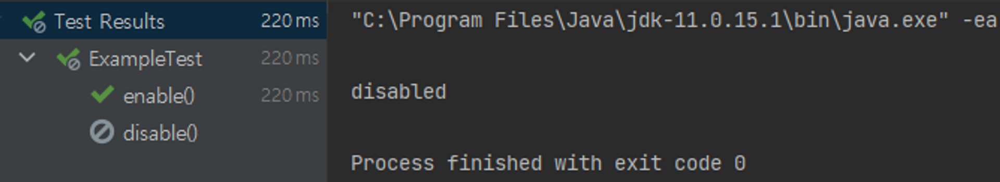

# Junit Extension
## Junit Extension

Junit 5 extensinon의 목적은 이름에서도 알 수 있듯이 테스트 클래스나 메서드의 행동을 확장하는 것이다. 이 설정은 여러 테스트에서 재사용될 수 있다.

## Junit 5 Extension Model

Junit 5 extension은 특정 테스트 실행 이벤트와 관련 있다. 특정 라이프 사이클 페이즈가 됐을 때 Junit 엔진은 등록된 확장을 호출한다.

- test instance post-processing
- conditional test-execution
- life-cycle callbacks
- parameter resolution
- exception handling

## Creating Junit 5 Extensions

Junit 5 extension을 만들기 위해선 `Extension` 인터페이스를 구현한 하나 이상의 인터페이스들을 구현할 필요가 있다.

### TestInstancePostProcessor Extension

이 extension은 테스트의 인스턴스가 만들어진 뒤 실행된다. `TestInstancePostProcessor` 인터페이스를 구현하면 `postProcessTestInstance()` 메서드를 재정의 해야 한다.

아래 예는 테스트 인스턴스에 특정 값을 주입하고 싶을 때 사용할 수 있는 방법이다.

```java
@ExtendWith(ExampleExtension.class)
public class ExampleTest {

	private String name;

	@Test
	void name() {
		assertThat(name).isEqualTo("success");
	}
}
```

```java
public class ExampleExtension implements TestInstancePostProcessor {

	@Override
	public void postProcessTestInstance(Object testInstance, ExtensionContext context) throws Exception {
		Field nameFiled = testInstance.getClass()
			.getDeclaredField("name");
		nameFiled.setAccessible(true);
		nameFiled.set(testInstance, "success");
	}
}
```

`TestInstancePostProcessor` 구현 후 리플렉션을 통해 필드에 값을 넣어주면 테스트가 통과한다.

### Conditional Test Execution

테스트를 실행할지 안할지 제어하는 extension도 존재한다. `ExecutionCondition` 인터페이스를 구현하면 된다.

```java
@ExtendWith(ExampleExtension.class)
public class ExampleTest {

	private String name = "success";

	@Test
	void enable() {
		assertThat(name).isEqualTo("success");
	}

	@Test
	void disable() {
		assertThat(name).isEqualTo("success");
	}
}
```

```java
public class ExampleExtension implements ExecutionCondition {

	@Override
	public ConditionEvaluationResult evaluateExecutionCondition(ExtensionContext context) {
		String displayName = context.getDisplayName();
		if (displayName.equals("disable()")) {
			return ConditionEvaluationResult.disabled("disabled");
		}
		return ConditionEvaluationResult.enabled("enabled");
	}
}
```

테스트 메서드 이름이 `disable()`인 테스트 메서드를 무시하도록 했다.


그런데 이 extension을 쓸 일이 있을까 싶다. 특정 테스트를 무시하려는 목적을 아직은 정확히 와닿지는 않는다. 위 예시처럼 쓰는 것은 `@Disabled` 어노테이션을 쓰는 것과 별반 다르지 않다.

아래 예시처럼 특정 실행 환경에서는 작동되지 않도록 하는 이용 법도 있는 듯 하다. `application.properties`에서 특정 값을 가져오는 데 QA 환경에서는 실행할 필요가 없거나 하면 안 되는 테스트에 적용하는 코드다.

```java
public class EnvironmentExtension implements ExecutionCondition {

    @Override
    public ConditionEvaluationResult evaluateExecutionCondition(
      ExtensionContext context) {
        
        Properties props = new Properties();
        props.load(EnvironmentExtension.class
          .getResourceAsStream("application.properties"));
        String env = props.getProperty("env");
        if ("qa".equalsIgnoreCase(env)) {
            return ConditionEvaluationResult
              .disabled("Test disabled on QA environment");
        }
        
        return ConditionEvaluationResult.enabled(
          "Test enabled on QA environment");
    }
}
```

### Lifecycle Callbacks

테스트 생명 주기와 연관 있는 extension들이다.

- `BeforeAllCallback` and `AfterAllCallback` – 모든 테스트 메서드 실행 전 후에 특정 작업을 실행할 수 있다.
- `BeforeEachCallBack` and `AfterEachCallback` – 각각의 테스트 메서드 실행 전 후에 특정 작업을 실행
- `BeforeTestExecutionCallback` and `AfterTestExecutionCallback` – 테스트 메서드 직전 또는 직후에 특정 작업을 실행한다.

만약 테스트 클래스가 자신의 라이프사이클 메서드도 사용한다면 순서는 다음과 같다.

1. BeforeAllCallback
2. BeforeAll
3. BeforeEachCallback
4. BeforeEach
5. BeforeTestExecutionCallback
6. Test
7. AfterTestExecutionCallback
8. AfterEach
9. AfterEachCallback
10. AfterAllCallback

사용해 본 대표적인 예는 테스트 전후에 실행될 작업이 여러 테스트 클래스에서 반복적으로 나타날 때 공통화를 위해서 사용해 보았다.

```java
public class SmodyTestEnvironmentExtension implements BeforeEachCallback, AfterEachCallback {

	@Override
	public void beforeEach(ExtensionContext context) {
		SmodyDatabaseManager smodyDatabaseManager = getSmodyDatabaseManager(context);
		smodyDatabaseManager.setUp();
	}

	@Override
	public void afterEach(ExtensionContext context) {
		SmodyDatabaseManager smodyDatabaseManager = getSmodyDatabaseManager(context);
		smodyDatabaseManager.truncateTables();
	}

	private SmodyDatabaseManager getSmodyDatabaseManager(ExtensionContext context) {
		return (SmodyDatabaseManager)SpringExtension
			.getApplicationContext(context).getBean("smodyDatabaseManager");
	}
}
```

```java
@SpringBootTest
@ExtendWith(SmodyTestEnvironmentExtension.class)
public class IntegrationTest {
```

통합 테스트를 진행할 시 IntegrationTest를 상속 받는 테스트들은 테스트 메서드가 각각 실행될 때마다 테스트 환경을 셋팅하고 테스트 후에는 DB를 truncate 시켜 격리 환경을 조성하도록 했다.

### Parameter Resolution

테스트 생성자나 메서드의 파라미터를 주입할 수 있다. `TestInstancePostProcessor`와 쓰임이 비슷하다.

```java
public class ExampleExtension implements ParameterResolver {

	@Override
	public boolean supportsParameter(ParameterContext parameterContext, ExtensionContext extensionContext) throws
		ParameterResolutionException {
		return parameterContext.getParameter().getType()
			.equals(String.class);
	}

	@Override
	public Object resolveParameter(ParameterContext parameterContext, ExtensionContext extensionContext) throws
		ParameterResolutionException {
		return "success";
	}
}
```

```java
@ExtendWith(ExampleExtension.class)
public class ExampleTest {

	private String name;

	public ExampleTest(String name) {
		this.name = name;
	}

	@Test
	void name() {
		assertThat(name).isEqualTo("success");
	}
}
```

### Exception Handling

`TestExecutionExceptionHandler` 인터페이스로 특정 예외가 발생했을 때 특정 작업을 실행시킬 수 있다. 아래는 `IllegalStateException`이 발생하면 무시한다는 extension의 예시이다.

```java
public class ExampleExtension implements TestExecutionExceptionHandler {

	@Override
	public void handleTestExecutionException(ExtensionContext context, Throwable throwable) throws Throwable {
		if (throwable instanceof IllegalStateException) {
			return;
		}
		throw throwable;
	}
}
```
아래 테스트는 통과한다.
```java
@ExtendWith(ExampleExtension.class)
public class ExampleTest {

	@Test
	void exception() {
		throw new IllegalStateException();
	}
}
```

### 참고

[https://www.baeldung.com/junit-5-extensions](https://www.baeldung.com/junit-5-extensions)
